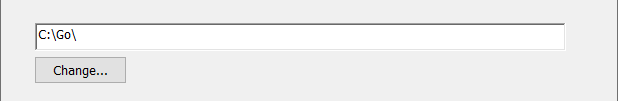
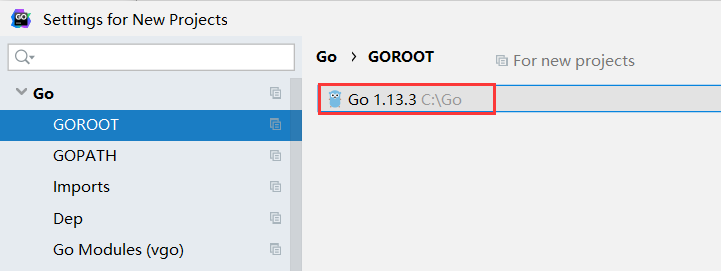
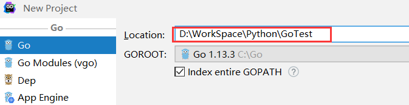

**Go 下载**

打开  https://golang.org/dl/ 或者 https://golang.google.cn/dl/ 找到对应系统版本进行下载。比如我这里是 Windows 系统，下载了 go1.13.3.windows-amd64.msi 安装包。

**Go 安装**

运行 Go 安装包，一般是 Next，设置安装路径，如下图所示：

直到安装完成。

安装完成之后，把 Go 的 bin 目录加入系统环境变量，如下图所示：

一般情况下，安装完成之后，会自动加入系统环境变量。

**GoLand IDE 配置 Go**

Settings → Go → GOROOT，如下图所示：

**GoLand IDE 创建 Go 项目**

New Project → 如下图所示：

然后进入正常开发流程。

