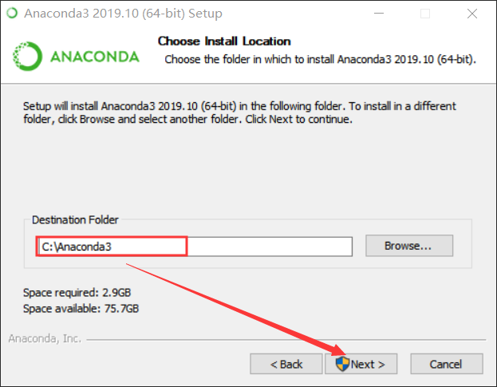
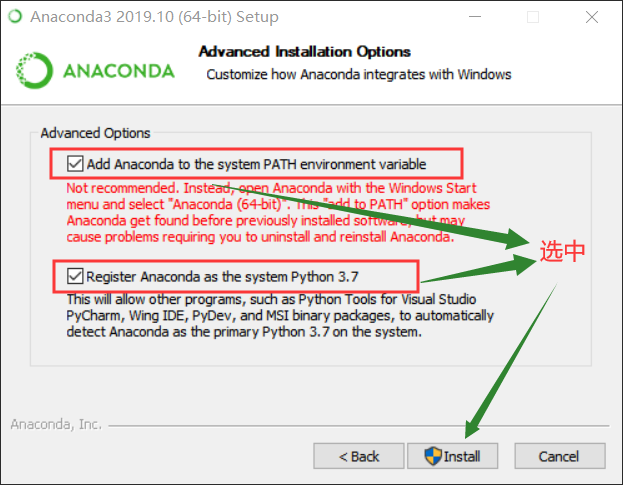
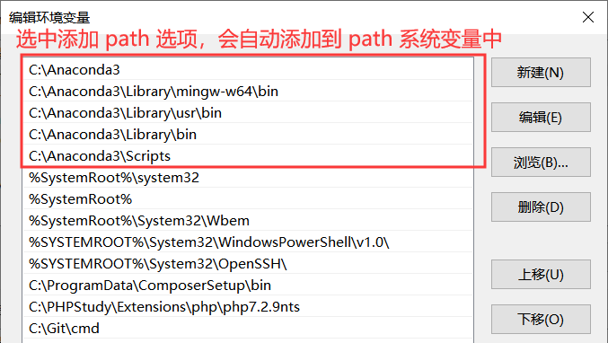
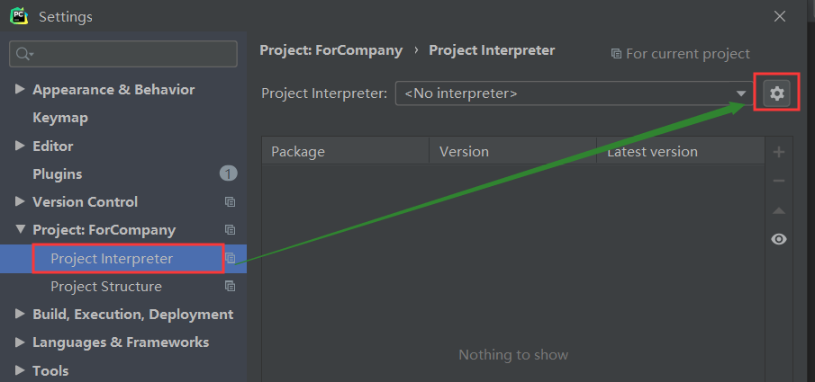
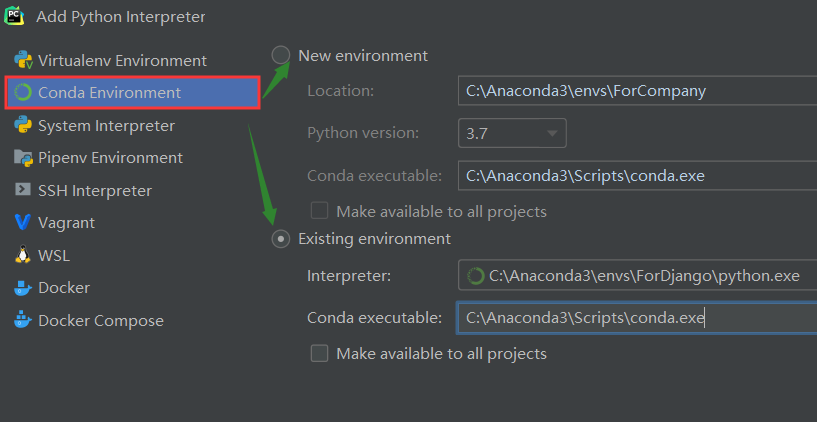

# Anaconda 下载和安装

## Anaconda 下载

下载地址：https://www.anaconda.com/distribution/

## Anaconda 安装

安装过程：







## 验证安装

打开 CMD 终端，输入如下命令：

```shell
C:\Users\Administrator\Desktop
λ conda -V
conda 4.7.12

C:\Users\Administrator\Desktop
λ
```

成功输出 Anaconda 的版本号，说明安装成功。

# Anaconda 常用命令

## 查看安装了哪些包以及版本号

```shell
C:\Users\Administrator\Desktop
λ conda list
```


## 更新 Anaconda 软件

```shell
C:\Users\Administrator\Desktop
λ conda update conda
Collecting package metadata (current_repodata.json): done
Solving environment: done

# All requested packages already installed.

C:\Users\Administrator\Desktop
λ
```


## 虚拟环境相关命令

### 创建虚拟环境

#### [ 不推荐 ] 不指定 Python 版本创建虚拟环境

```shell
C:\Users\Administrator\Desktop
λ conda create -n ForDjango
Collecting package metadata (current_repodata.json): done
Solving environment: done
## Package Plan ##
  environment location: C:\Anaconda3\envs\ForDjango
Proceed ([y]/n)? y
Preparing transaction: done
Verifying transaction: done
Executing transaction: done
#
# To activate this environment, use
#
#     $ conda activate ForDjango
#
# To deactivate an active environment, use
#
#     $ conda deactivate
C:\Users\Administrator\Desktop
λ
```
所有虚拟环境都可以在 C:\Anaconda3\envs 目录下找到。

#### [ 推荐 ] 指定 Python 版本创建虚拟环境

```shell
C:\Users\Administrator\Desktop
λ conda create -n Py35ForNumpy python=3.5
Collecting package metadata (current_repodata.json): done
Solving environment: failed with repodata from current_repodata.json, will retry with next repodata source.
Collecting package metadata (repodata.json): done
Solving environment: done
## Package Plan ##
  environment location: C:\Anaconda3\envs\Py35ForNumpy
  added / updated specs:
    - python=3.5
The following packages will be downloaded:
    package                    |            build
    ---------------------------|-----------------
    certifi-2018.8.24          |           py35_1         137 KB
    pip-10.0.1                 |           py35_0         1.6 MB
    python-3.5.6               |       he025d50_0        14.5 MB
    setuptools-40.2.0          |           py35_0         497 KB
    wheel-0.31.1               |           py35_0          82 KB
    wincertstore-0.2           |   py35hfebbdb8_0          14 KB
    ------------------------------------------------------------
                                           Total:        16.8 MB
The following NEW packages will be INSTALLED:
  certifi            pkgs/main/win-64::certifi-2018.8.24-py35_1
  pip                pkgs/main/win-64::pip-10.0.1-py35_0
  python             pkgs/main/win-64::python-3.5.6-he025d50_0
  setuptools         pkgs/main/win-64::setuptools-40.2.0-py35_0
  vc                 pkgs/main/win-64::vc-14.1-h0510ff6_4
  vs2015_runtime     pkgs/main/win-64::vs2015_runtime-14.16.27012-hf0eaf9b_0
  wheel              pkgs/main/win-64::wheel-0.31.1-py35_0
  wincertstore       pkgs/main/win-64::wincertstore-0.2-py35hfebbdb8_0
Proceed ([y]/n)? y
Downloading and Extracting Packages
certifi-2018.8.24    | 137 KB    | ################################################################################ | 100%
setuptools-40.2.0    | 497 KB    | ################################################################################ | 100%
wheel-0.31.1         | 82 KB     | ################################################################################ | 100%
pip-10.0.1           | 1.6 MB    | ################################################################################ | 100%
wincertstore-0.2     | 14 KB     | ################################################################################ | 100%
python-3.5.6         | 14.5 MB   | ################################################################################ | 100%
Preparing transaction: done
Verifying transaction: done
Executing transaction: done
#
# To activate this environment, use
#
#     $ conda activate Py35ForNumpy
#
# To deactivate an active environment, use
#
#     $ conda deactivate
C:\Users\Administrator\Desktop
λ
```

所有虚拟环境都可以在 C:\Anaconda3\envs 目录下找到。

### 列出虚拟环境

```shell
C:\Users\Administrator\Desktop
λ conda env list
# conda environments:
#
base                  *  C:\Anaconda3
ForDjango                C:\Anaconda3\envs\ForDjango
Py35ForNumpy             C:\Anaconda3\envs\Py35ForNumpy

C:\Users\Administrator\Desktop
λ conda info -e
# conda environments:
#
base                  *  C:\Anaconda3
ForDjango                C:\Anaconda3\envs\ForDjango
Py35ForNumpy             C:\Anaconda3\envs\Py35ForNumpy

C:\Users\Administrator\Desktop
λ
```

### 激活虚拟环境

```shell
C:\Users\Administrator\Desktop
λ conda activate ForDjango

C:\Users\Administrator\Desktop
(ForDjango) λ
```

### 退出虚拟环境

```shell
C:\Users\Administrator\Desktop
λ conda activate ForDjango

C:\Users\Administrator\Desktop
(ForDjango) λ conda deactivate

C:\Users\Administrator\Desktop
λ
```

### 删除虚拟环境

```shell
C:\Users\Administrator\Desktop
λ conda remove -n Py35ForNumpy --all
```

只是卸载了其中安装的库文件，并没有把虚拟环境文件夹删除。

### 虚拟环境安装库文件

```shell
C:\Users\Administrator\Desktop
λ conda install -n ForDjango django
Collecting package metadata (current_repodata.json): done
Solving environment: done
```

或者激活虚拟环境后，再安装库文件：

```shell
C:\Users\Administrator\Desktop
λ conda activate ForDjango

C:\Users\Administrator\Desktop
(ForDjango) λ pip install Django
```

### 虚拟环境卸载库文件

```shell
C:\Users\Administrator\Desktop
λ conda remove --name ForDjango django
Collecting package metadata (repodata.json): done
Solving environment: done
## Package Plan ##
  environment location: C:\Anaconda3\envs\ForDjango
  removed specs:
    - django
The following packages will be REMOVED:
  django-2.2.5-py38_1
  pytz-2019.3-py_0
  sqlparse-0.3.0-py_0
Proceed ([y]/n)? y
Preparing transaction: done
Verifying transaction: done
Executing transaction: done
```


# PyCharm 配置 Anaconda 虚拟环境

File → Settings → Project Interpreter：





Anaconda 简单使用说明记录到此。

