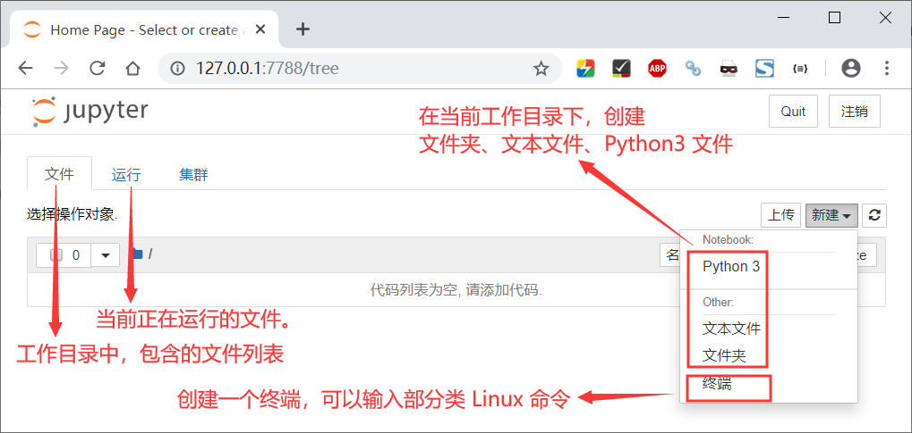
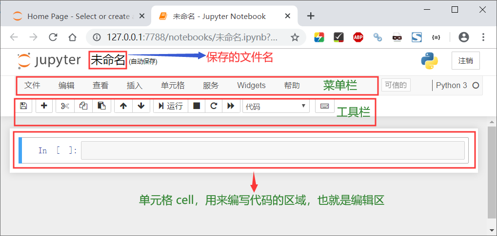
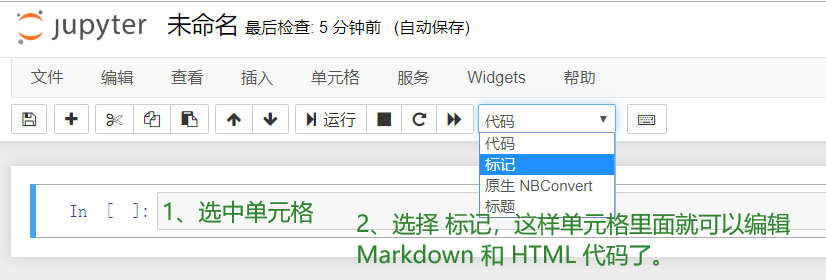
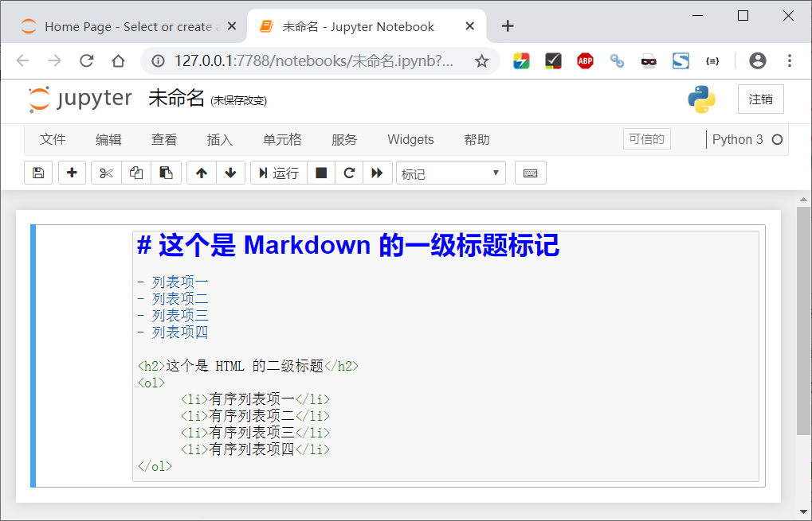
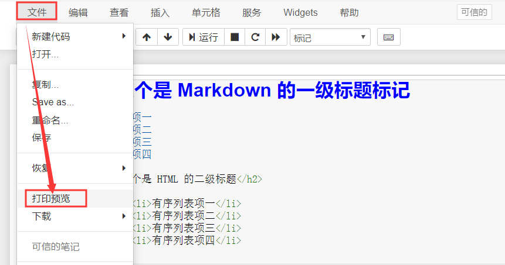
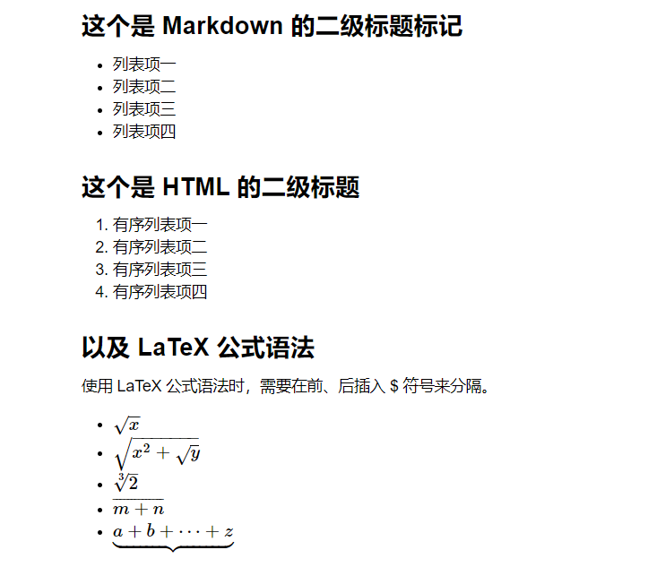

# Jupyter 使用

## 界面说明

### Jupyter 启动界面



### 新建 Notebook 界面

Jupyter 启动界面 → 新建 → Python 3，就进入了 Jupyter Notebook 的界面了，界面如下所示：



## 编写 Markdown

### 切换单元格编辑器的编辑类型



### Markdown、HTML、LaTeX



### 预览编辑的最终效果



即可预览 Notebook 编辑完成之后的效果，如下图所示：



### 附带以上编写的源码

```shell
## 这个是 Markdown 的二级标题标记

- 列表项一
- 列表项二
- 列表项三
- 列表项四

<h2>这个是 HTML 的二级标题</h2>
<ol>
    <li>有序列表项一</li>
    <li>有序列表项二</li>
    <li>有序列表项三</li>
    <li>有序列表项四</li>
</ol>
<h2>以及 LaTeX 公式语法</h2>
<p>使用 LaTeX 公式语法时，需要在前、后插入 $ 符号来分隔。</p>
<ul>
    <li>$\sqrt{x}$</li>
    <li>$\sqrt{ x^2 + \sqrt{ y } }$</li>
    <li>$\sqrt[3]{2}$</li>
    <li>$\overline{m+n}$</li>
    <li>$\underbrace{a+b+\cdots+z}$</li>
</ul>
```

### 附带 LaTeX 相关资料

一份不太简短的LATEX2ε介绍：http://www.mohu.org/info/lshort-cn.pdf

常用数学符号的 LaTeX 表示方法：http://www.mohu.org/info/symbols/symbols.htm

## 更换主题

Jupyter Notebook 更换主题：https://www.jianshu.com/p/d1793b480e68

### 安装主题

```shell
pip install -i https://pypi.doubanio.com/simple/ jupyterthemes
```

### 列出主题

```shell
C:\Users\Administrator\Desktop
λ jt -l
Available Themes:
   chesterish
   grade3
   gruvboxd
   gruvboxl
   monokai
   oceans16
   onedork
   solarizedd
   solarizedl
```

### 更换主题

命令格式为：如果不加 -T 参数，则会丢失工具栏，也就是不显示工具栏。

```shell
λ jt -t 主题名 -T
```

以下两种主题是个人比较喜欢的主题：

```shell
C:\Users\Administrator\Desktop
λ jt -t oceans16 -T

C:\Users\Administrator\Desktop
λ jt -t onedork -T

C:\Users\Administrator\Desktop
λ
```

更换主题完成之后，需要重启 Jupyter 服务才能起作用。

### 恢复默认

```shell
C:\Users\Administrator\Desktop
λ jt -r
Reset css and font defaults in:
C:\Users\Administrator\.jupyter\custom &
C:\Users\Administrator\AppData\Roaming\jupyter\nbextensions

C:\Users\Administrator\Desktop
λ
```


