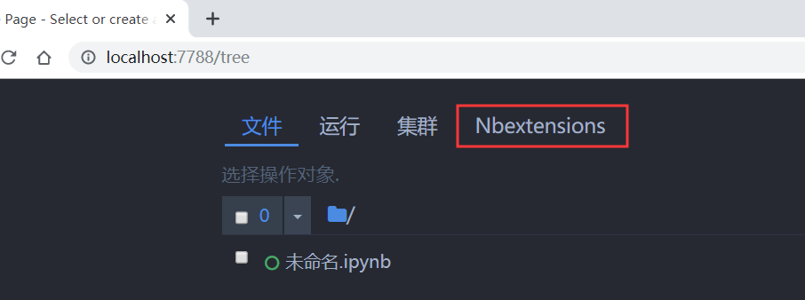

# Jupyter 安装扩展

## 安装扩展

```shell
pip install -i https://pypi.doubanio.com/simple/ jupyter_contrib_nbextensions
```

```shell
jupyter contrib nbextension install --user
```

执行以上两条命令完成安装过程。

## 启用扩展

```shell
jupyter nbextension enable codefolding/main
```

执行上述命令后，重启 Jupyter Notebook ，此时启动界面多了一个菜单，如下图所示：



点击 Nbextensions 就可以看到插件的配置页面了。

# Jupyter 使用插件

## 代码补全插件

Hinterland

## 代码折叠

Codefolding

## 代码美化

Code prettify

## 表格美化

table_beautifier

