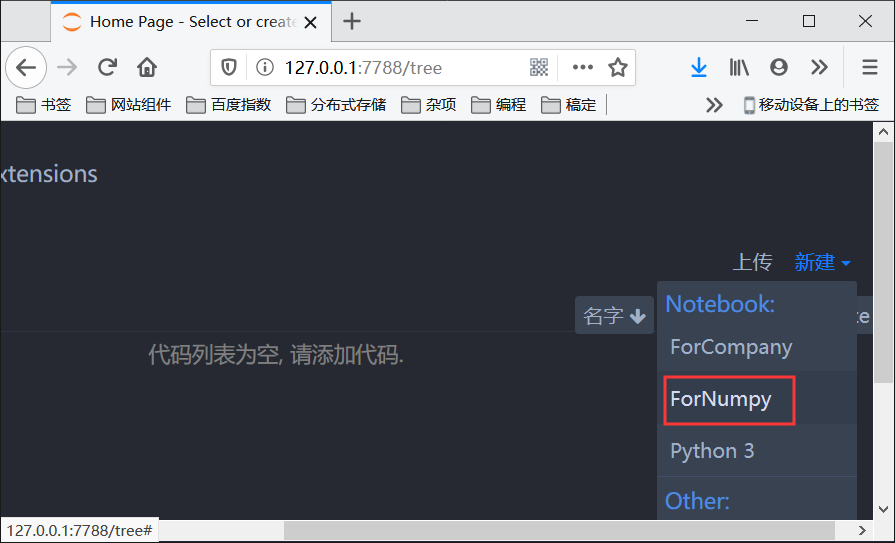

# Jupyter 配置虚拟环境

1、创建虚拟环境

```shell
mkvirtualenv ForNumpy
```

2、激活虚拟环境

```shell
workon ForNumpy
```

3、在虚拟环境中安装 ipykernel

```shell
(ForNumpy) λ pip install -i https://pypi.doubanio.com/simple/ ipykernel
```

4、在 ipykernel 中注册虚拟环境

```shell
(ForNumpy) λ python -m ipykernel install --user --name=ForNumpy
Installed kernelspec ForNumpy in C:\Users\Administrator\AppData\Roaming\jupyter\kernels\fornumpy
```
5、在新建中出现了我们配置的虚拟环境



以上就是在 Jupyter 中配置虚拟环境的整个过程。