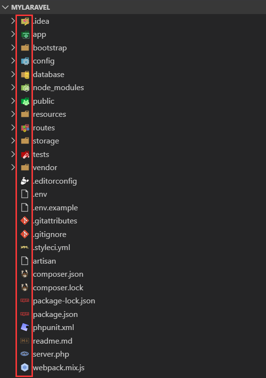

[TOC]

清理历史配置：
打开 C:\Users\Administrator 找到 .vscode 文件夹并删除即可。

# 下载和安装
打开 Visual Studio Code 下载页面 https://code.visualstudio.com/Download 选择 Windows 的 **.zip** <font color="#0071BC">64 bit</font> 版本进行下载。
下载下来之后，解压缩到 ==C:\VSCode== 目录中，并把该目录添加到系统环境变量中，如下图所示：


把 ==Code.exe== **固定到 “开始” 屏幕**中，方便启动。

# 安装通用插件

## 安装 Settings Sync 插件

查找 ==Settings Sync== 如下图所示：


并进行安装。

它是最好用的插件，没有之一，一台电脑配置好之后，其它的几台电脑都不用配置。新机器登录一下就搞定了。再也不用折腾环境了，使用 GitHub Gist 同步多台计算机上的设置，包括代码段、主题、文件图标、启动键绑定、工作区和扩展等。

## 安装 Debugger for Chrome 插件

查找 ==Debugger for Chrome== 如下图所示：


进行安装，它可以从 VS Code 中调试在 Google Chrome 中运行的 JavaScript 代码。用于在 Google Chrome 浏览器或支持 Chrome DevTools 协议的其他目标中调试 JavaScript 代码的 VS Code 扩展。

## 安装 beautify 插件

查找 ==beautify== 如下图所示：


进行安装，它可以在 VS Code 中美化 JavaScript、JSON、CSS、Sass 和 HTML 的代码。

## 安装 Atuo Rename Tag 插件

查找 ==Atuo Rename Tag== 如下图所示：


这个插件的主要用途是在修改 HTML、XML 标签时，使标签头部和尾部进行同步修改。

## 安装 Code Spell Checker 插件

查找 ==Code Spell Checker== 如下图所示：


这是一款代码拼写检查插件，此拼写检查程序的目标是帮助捕获常见的拼写错误，同时保持误报数量较低。

## 安装 vscode-icons 插件

查找 ==vscode-icons== 如下图所示：


显示 Visual Studio 代码的图标，目前该插件已被 VS Code 内部支持 → 文件 → 首选项 → 文件图标主题 → 进行配置即可。效果图如下：



方便区分不同的程序。

## 安装 guides 插件

查找 ==guides== 如下图所示：


进行安装，不过 VS Code 已经内置了该功能，所以这个插件可以不安装。因为安装完该插件之后，右下角会提示是使用该插件还是使用内置 built-in ，我们选择内置即可。

## 安装 Rainbow Brackets 插件

查找 ==Rainbow Brackets== 进行安装，如下图所示：


为圆括号，方括号和大括号提供彩虹色。这对于 Lisp 或 Clojure 程序员，当然还有 JavaScript 和其他程序员特别有用。

## 安装 Bracket Pair Colorizer 插件

查找 ==Bracket Pair Colorizer== 进行安装，如下图所示：


用于对匹配的括号进行着色，方便开发人员锁定代码块。

## 安装 Indent-Rainbow 插件

查找 ==Indent-Rainbow== 进行安装，如下图所示：


它会用四种不同颜色交替着色文本前面的缩进。

## 安装 filesize 插件

查找 ==filesize== 进行安装，如下图所示：


在状态栏中显示当前文件大小，点击后还可以看到详细创建、修改时间等文件相关信息，如下图例子：


## 安装 Project Manager 插件

查找 ==Project Manager== 进行安装，如下图所示：


方便对打开的项目进行管理，方便切换项目。

## 安装 Language Support for Java 插件

查找 ==Language Support for Java(TM) by Red Hatredhat.java== 进行安装，如下图所示：


## 安装 Todo Tree 插件

查找 Todo Tree 进行安装，如下图所示：


此扩展可以快速搜索您的工作区以获取 TODO 和 FIXME 等注释标记，并在资源管理器窗格的树视图中显示它们。
单击树中的 TODO 将打开文件并将光标放在包含 TODO 的行上。找到的 TODO 也可以在打开的文件中突出显示。

## 安装中文语言包

菜单栏 → View → Extensions → 在输入框输入如下字符串：
Chinese (Simplified) Language Pack for Visual Studio Code

搜索结果如下图所示：


点击 <font style="background-color:green;color:white">Install</font> 进行安装，安装完成之后，界面的右下角弹出提示框：


提示进行重启，我们点击 <font style="background-color:#0071BC;color:white">Restart Now</font> 进行重启，重启后界面就变成中文界面了。

重启之后，右下角又弹出提示，如下图所示：


单击 <font style="background-color:#0071BC;color:white">Install</font> 进行安装，这个插件的名称为 ==Remote - WSL ms-vscode-remote.remote-wsl== 如下图所示：


该插件的主要作用是能把 Windows 当成 Linux 的生产力工具。

## 安装 HTML 代码提示

插件名称为 ==HTML Snippets== 如下图所示：


查看安装量最高的版本进行安装。

## 安装 HTMLHint 插件

查找 ==HTMLHint== 插件并安装，如下图所示：


用于对 HTML 进行代码检测，包括 HTML5 的代码。

## 安装 CSS 代码提示

插件名称为 ==HTML CSS Support== 如下图所示：


进行安装即可。

## 安装 jQuery Code Snippets 代码提示

查找 ==jQuery Code Snippets== 并安装，如下图所示：


超过 130 个用于 JavaScript 代码的 jQuery 代码片段。只需键入字母 **jq** 即可获得所有可用 jQuery 代码片段的列表。


# 配置编程插件

## 配置 Python 开发环境

### 安装 Python 插件

查找 Python 如下图所示：


开发 Python 时，必须安装的扩展。


### 配置 Python 运行环境

#### 配置 settings.json 文件

在 .vscode 文件夹下面创建 settings.json 文件，然后添加如下代码：

```json
"python.pythonPath": "[你的python虚拟环境路径]/Scripts/python.exe"
```

我们在该配置文件添加好虚拟路径之后，此时 settings.json 文件的内容如下所示：

```json
{   
    // 配置运行的虚拟环境路径
    "python.pythonPath": "D:/VersionPortable/PythonEnv/ScrapyUploadImage/Scripts/python.exe",
    "editor.fontSize": 18, // 配置项目使用的字体
    "python.formatting.provider": "yapf", // 配置格式化提供者
    "python.linting.pylintEnabled": true, // 配置是否使用 pylint 校验代码
}
```

如何验证是否使用了该虚拟环境呢？

终端 → 新建终端，如下图所示：


说明我们已经进入了 Python 虚拟环境。通过这种方式，我们可以给每个 Python 项目配置不同的虚拟环境。

#### 配置 launch.json 文件

菜单 → 调试 → 打开配置 → 即可打开 launch.json 配置文件，其实也是在 .vscode 目录下，我们在 launch.json 配置文件中添加如下代码：

```json
{
    // 使用 IntelliSense 了解相关属性。 
    // 悬停以查看现有属性的描述。
    // 欲了解更多信息，请访问: https://go.microsoft.com/fwlink/?linkid=830387
    "version": "0.2.0",
    "configurations": [
        {
            "name": "Python: Current File (Integrated Terminal)",
            "type": "python",
            "request": "launch",
            "program": "${file}",
            // pythonPath 对应 settings.json 配置文件中的 python.pythonPath 配置项
            "pythonPath": "${config:python.pythonPath}",
            "console": "integratedTerminal",
            "env": {},
            "envFile": "${workspaceFolder}/.env",
        }
    ]
}
```

其实有些配置既可以写在 settings.json 的配置文件，也可以写在 launch.json 配置文件中。

### Scrapy 的 No module named

在运行 Scrapy 项目时，会碰到 Scrapy 项目模块名没有导入的问题，比如我们创建的 Scrapy 项目为 ScrapyMongoDBForSearch，在运行时，会碰到如下问题：

```shell
(ScrapyUploadImage) D:\WorkSpace\Python\ScrapyMongoDBForSearch>D:/VersionPortable/PythonEnv/ScrapyUploadImage/Scripts/python.exe d:/WorkSpace/Python/ScrapyMongoDBForSearch/ScrapyMongoDBForSearch/spiders_requests/requests_baidu.py
Traceback (most recent call last):
  File "d:/WorkSpace/Python/ScrapyMongoDBForSearch/ScrapyMongoDBForSearch/spiders_requests/requests_baidu.py", line 9, in <module>
    from ScrapyMongoDBForSearch.tools.common import raplace_domains, generator_file, returnBaseDir
ModuleNotFoundError: No module named 'ScrapyMongoDBForSearch'
```

解决办法一：

在文件中 from ScrapyMongoDBForSearch…… 语句之前，加入如下代码：

```python
import sys
import os
fpath = os.path.abspath(os.path.join(os.path.dirname(__file__),".."))
ffpath = os.path.abspath(os.path.join(fpath,".."))
sys.path.append(ffpath)
```

即可解决。

如果爬虫文件距离项目根目录层级太深可能要多加几句，比如：

```python
import sys
import os
pro_path = os.path.abspath(os.path.join(os.path.dirname(__file__),".."))
pro_path = os.path.abspath(os.path.join(pro_path,".."))
pro_path = os.path.abspath(os.path.join(pro_path,"..")) # 根据需要多加几次
sys.path.append(pro_path)
```


### 给 Python 安装库文件
使用快捷键 Ctrl + ` 打开 cmd 终端，然后 workon 激活虚拟环境，然后通过如下格式来安装 Python 库文件，比如：
```shell
pip install -i https://pypi.doubanio.com/simple/ pylint
```
整个操作过程如下图所示：


```shell
pip install -i https://pypi.doubanio.com/simple/ yapf
```


## 配置 PHP 开发环境

### 安装 PHP IntelliSense 插件

该插件实现 PHP 中的函数跳转功能，查找 ==PHP IntelliSense== 插件进行安装，如下图所示：


安装完成之后，需要进行配置。

 https://blog.csdn.net/yang958554999/article/details/89015273 

`https://www.cnblogs.com/clwydjgs/p/10078065.html`