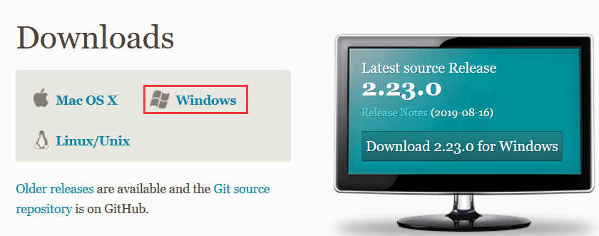
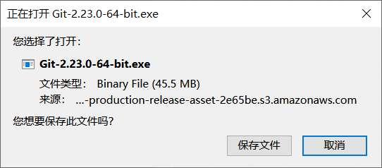
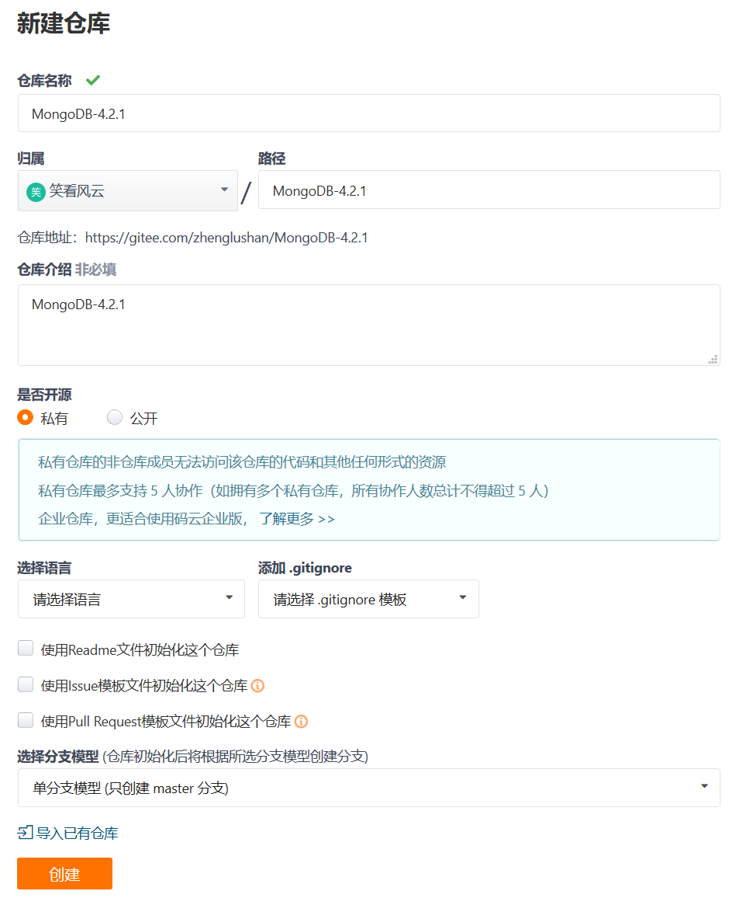
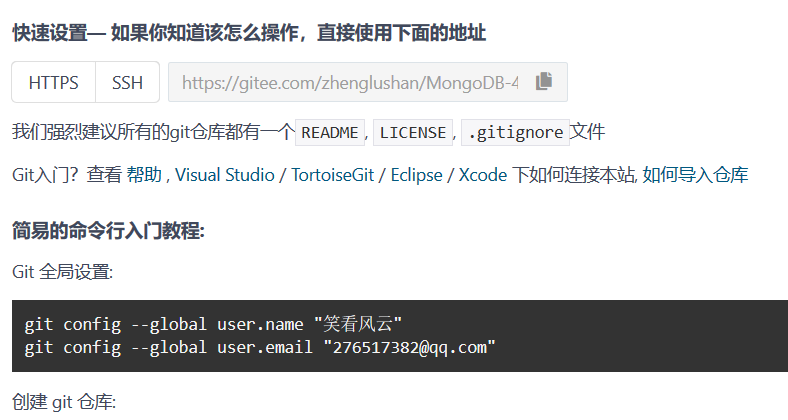
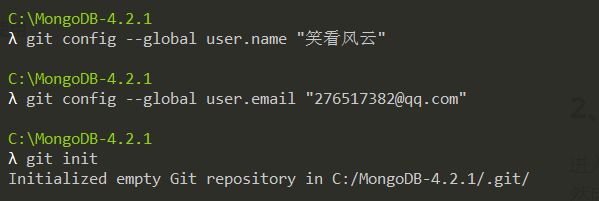
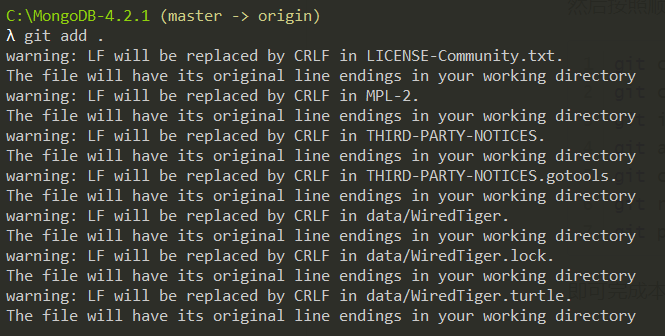
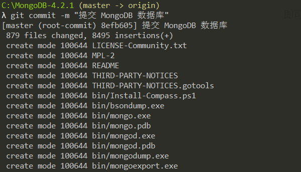
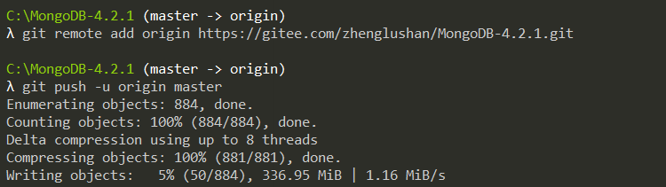

[TOC]


# Git 下载和安装

## Git 介绍
Git 官网地址为：https://git-scm.com/
## Git 下载
Git 下载地址为：https://git-scm.com/downloads
由于使用的是 Windows 系统，所以选择 Windows 版本下载，如下图所示：



点击 <font color="#0388a6">**Windows**</font> 之后，页面转到  https://git-scm.com/download/win 页面，并弹出下载对话框，如下图所示：



同时，在该页面有 <font color="#f14e32">**Read the Book**</font> 链接，点击进入  https://git-scm.com/book/en/v2 页面，点击<font color="#0388a6">简体中文</font>切换为中文版，然后点击右侧的 ==pdf== 进行下载中文版文档。
## Git 安装
安装时，直接默认下一步即可安装完成。
# Git 使用教程
我的 Gitee 仓库地址为：https://gitee.com/zhenglushan
## 提交 MongoDB 数据库
在提交 MongoDB 数据库之前，我们需要先关闭 MongoDB 的服务。
### 在 Gitee 创建远程仓库
如下图所示：



安装上面<font style="background:#f38d30; color:#ffffff;line-height:16px;padding:0px 33px;margin-top:-3px;font-size:16px">创建</font>完仓库之后，由于仓库里面是空的，所以会显示快速设置和入门信息，如下图所示：



### 创建本地 Git 仓库并提交|
进入 ==C:\MongoDB-4.2.1== 目录，右键单击 **Git Bash Here** 打开 Git 命令行工具。
然后按照顺序执行如下命令：

```shell
git config --global user.name "笑看风云"
git config --global user.email "276517382@qq.com"
git init
git add . # 暂存
git commit -m "提交 MongoDB 数据库" # 提交
git remote add origin https://gitee.com/zhenglushan/MongoDB-4.2.1.git
git push -u origin master # 推送
```
即可完成本地仓库和远程仓库的关联。过程如下图所示：









出现如下错误信息：
```shell
error: RPC failed; HTTP 413 curl 22 The requested URL returned error: 413
fatal: the remote end hung up unexpectedly
Writing objects: 100% (884/884), 2.04 GiB | 2.02 MiB/s, done.
Total 884 (delta 91), reused 0 (delta 0)
fatal: the remote end hung up unexpectedly
Everything up-to-date
```
### 使用 ssh 方式提交
把上面的提交方式修改为：
```shell
git remote set-url origin ssh://git@gitee.com/zhenglushan/MongoDB-4.2.1.git
git push -u origin master # 推送
```
即可。

