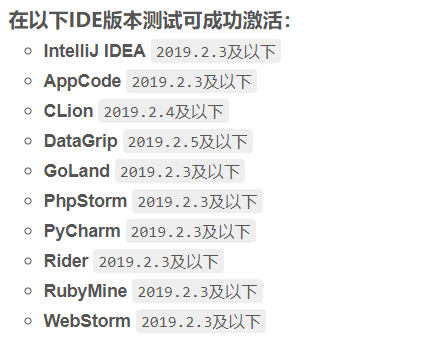
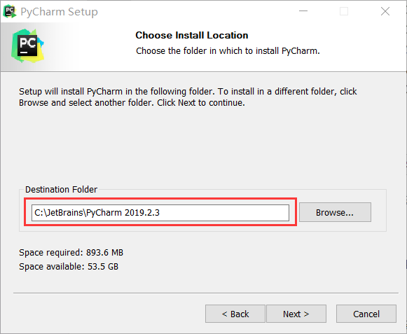
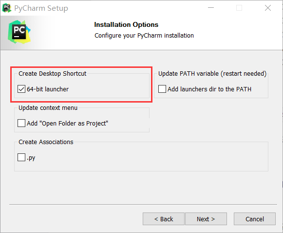

步骤：
1、下载软件安装包
2、下载破解补丁
3、修改 hosts 文件，添加如下两行代码：
```shell
# JetBrains 配置
0.0.0.0 account.jetbrains.com
0.0.0.0 www.jetbrains.com
```
4、安装软件包
比如我把 PyCharm 安装到 C:\JetBrains\PyCharm 2019.2.3 目录下，





5、破解
**a**、先把 jetbrains-agent.jar 复制到 C:\JetBrains 目录下，方便全家桶所有软件共同引用。
**b**、然后打开 C:\JetBrains\软件\bin 目录下的 **xxx.exe.vmoptions** 和 **xxx==64==.exe.vmoptions** 文件，添加如下代码：

```shell
-javaagent:C:\JetBrains\jetbrains-agent.jar
```
不论是全家桶的哪款软件，都是 -javaagent 后面跟上破解的 jar 包的路径。
**c**、激活方法：下面是两种永久激活的方式：
（1）、启动软件 → Help → Register → License Server → http://jetbrains-license-server → Active 即可，该方式授权后，没有显示到期日期。
（2）、选择 Activation code 方式， https://zhile.io/custom-license.html  https://zhile.io/custom/license 需要登录 GitHub 账号并授权给 zhile 即可，该方式授权后，过期日期为 2089 年。
**d**、查看软件激活状态和过期时间 → Help → About
激活参考：
 https://www.cnblogs.com/ccav1/p/11713114.html

