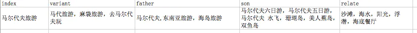
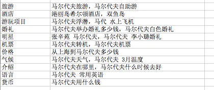

具体上一篇SEO数据分析文章已经隔了很久了，今天有个朋友网上问我，有了词库怎么维护。正好借这个机会谈谈这个问题。 在获取到大量关键词后，首先要对这些词进行处理，在我实际工作中，总结以下几个项目我做过或者觉得有必要做的事情。

提取实体(通俗点讲就是找关键词中的重点词)1、去重2、受控词表3、分类4、提取实体

提取实体的概念就是找关键词中的重点词。比如 “北京温泉哪里好”，那这个词中的”北京 “和”温泉”这两个词是重点，”哪里好”只是一个疑问词，对主题描述帮助相对比较小。于是我们就需要通过一些技术手段，对关键词进行处理，把中间重要的关键词（实体）取出来。

先看看下面的关键词

**处理前**

北京博物馆大全

北京怀北滑雪场

杭州到北京动车

北京金山岭长城

北京旅行社排名

北京冬天去哪玩

西安到北京高铁

厦门到北京机票**处理后**北京|博物馆

北京|怀北|滑雪场

杭州|北京|动车

北京|金山岭|长城

北京|温泉

北京|旅行社|排名

北京|冬天|玩

西安|北京|高铁

厦门|北京|机票

可以仔细观察一下两者的不同。这边算法有很多种实现方法，鉴于从SEO的角度出发，我们对精确度和召回率的要求，一般都比较低。从0%到80%要花费的心思，可能还没从80%~100%要花费的心思多。并且不同行业的，会有略微不同的做法。于是我采取以下两个方法

1.根据词性删除停词符号(多删一些不要紧)2.根据tf-idf过滤高频词

> TF-IDF（term frequency–inverse document frequency）是一种用于资讯检索与资讯探勘的常用加权技术。TF-IDF是一种统计方法，用以评估一字词对于一个文件集或一个语料库中的其中一份文件的重要程度。字词的重要性随着它在文件中出现的次数成正比增加，但同时会随着它在语料库中出现的频率成反比下降。TF-IDF加权的各种形式常被搜索引擎应用，作为文件与用户查询之间相关程度的度量或评级。除了TF-IDF以外，因特网上的搜索引擎还会使用基于链接分析的评级方法，以确定文件在搜寻结果中出现的顺序。

这边说说分词算法，很多学术派研究了一大堆中文分词算法，但实际运用起来差别很小。这边随便推荐几个，根据自己会的语言使用。

ICTCLAS [http://ictclas.nlpir.org/downloads](https://link.jianshu.com?t=http://ictclas.nlpir.org/downloads) 语言:Java,C#CRF++ [http://crfpp.sourceforge.net/](https://link.jianshu.com?t=http://crfpp.sourceforge.net/) 语言: C#SCWS [http://www.xunsearch.com/scws/](https://link.jianshu.com?t=http://www.xunsearch.com/scws/) 语言: PHPJIEBA [https://pypi](https://link.jianshu.com?t=https://pypi).[python](https://link.jianshu.com?t=http://www.168seo.cn/python).org/pypi/jieba/ 语言:Python

分词也是一门大学问，有兴趣可以看看CRF,HMM等模型的逻辑。这边就不展开讲了。

分词关键的问题是要速度快，并且可以自定义词库。由于我用的是JIEBA，这方面都能支持。具体可以看看作者个github中的说明[https://github.com/fxsjy/jieba/blob/master/README.md](https://link.jianshu.com?t=https://github.com/fxsjy/jieba/blob/master/README.md)

分词后根据词性，排除掉”停词”，就获取到了我们想要的结果集合。

过滤高频词。JIEBA可以对整个文本提取tf-idf值高的词。这些词是核心，肯定不可以去掉。

然后根据分词结果获取到tf值高的词，进行人工审核一下，以我们旅游行业词库为例，地名是经常出现的词，tf值可能会非常高，但是绝对不能把它去掉。所以我们需要先准备一份中国地名/景点名词库，这个可以在网上搜索下，懒人可以直接用搜狗输入法的词库。

然后高频词中还有可能会出现的词，可能为”7月”，”8月”，”大全”，”线路”等等。这些词也可以考虑把它从实体词中踢除。

经过这几轮检查，基本就差不多了，再要精度可以再自行研究。肯定有人问，你折腾了这么久，有什么用？这边只能点到为止。

1.内容关联2.自动tagging3.提高站内检索精度

去年到今年搜房和安居客的SEO可以体会一下。

**去重**

提取实体后，就可以对关键词进行去重。

例如

海南旅游多少钱海南旅游要多少钱

**处理后**

海南|旅游海南|旅游

就可以进行去重了。上面着两个个词，还可以通过实体相同的方法来解决。但是有一些关键词，比如”马尔代夫”和”马代”，”长城”和”八达岭”，用户可以是指一个地方，我们应该怎么处理这些词。我们就需要下面这么一个东西“受控词表”

**受控词表**

受控词表，就是一种控制词汇含义，并且跟踪其相关词的方法。回到上面的例子，如果你搜索”八达岭”的时候，不能把长城的内容展现出来，相信用户早就跑光了。受控词表主要有如下三大关系：**等价**，**层级**，**关联****等价**很好理解，比如马尔代夫和马代，那是等价关系，这类词可以说就是一个意思，权值是最高的。在内容推荐中一定要呈现出来。

**层级**有上下级之分，比如“夫子庙”是”南京景点大全”的下级词。”大成殿”又是”夫子庙”的下级词。在实际应用的时候，当用户在寻找”大成殿”时，网站可以告诉用户你位于”夫子庙”中间，并且推荐夫子庙周围还有些什么好玩的东西，用户一定会非常喜欢。层级关系也是大部分网站都有的信息架构体系，从首页，到目录，到栏目。

**关联**，有点类似于等价，但是并不完全相同，例如”三亚跟团游”，”海口自助游”，”海南旅游 双飞”。他们没有说明确的上下级关系，但是又不能说完全一样。这类词，我们可以把其作为有关联的东西。可以记录下来。此外，一些内容的自带的属性，比如高，富，帅，可以作为一个相关联的关键词，在内容推荐上更加满足用户的口味。

这边还要提一点，在工作中，我们发现了用户有时候会有一些**特殊的词汇**来表达自己的需求，比如”麻袋”（谐音马代），或者”百撕不得骑姐”这样该死的输入法错拼，这些关键词都需要存放起来。

最后应该是这样的效果：

分类

对于获取到的大量关键词，应该怎么去分类。首先可以按照意图进行分类，导航，信息，事务。（学习资料-知乎：[http://www.zhihu.com/question/20905145](https://link.jianshu.com?t=http://www.zhihu.com/question/20905145)）

这么做的好处是，可以快速知道把哪一类词，分给哪条产品线做。例如信息类的词，尽量放到资讯，问答，产品库这样的频道。导航类的词，如果是自己品牌可以做，如果是竞争对手品牌，可以单独做频道。事务类的词，一般放在主力产品线上，页面上会有功能体现，比如”添加到购物车”，”下载链接“，”在线预定”等等。在一定程度上满足用户的需求，避免内容错位。比如这个 [http://iphone.tgbus.com/tag/iphone6tieba/](https://link.jianshu.com?t=http://iphone.tgbus.com/tag/iphone6tieba/) “iphone6贴吧”。贴吧在哪？好歹给个链接地址吧。

除了上面的分意图类法，下面讲讲从结合信息架构中的分类方法。

先介绍一个人工分拣关键词的方法：卡片分拣。通过尝试，这的确是一种可以集思广益的分类方法。我们从”马尔代夫”的关键词词库中抽取了500个关键词，随机分配给5个小组。每组把手头上的关键词进行自由分组，并且自行命名组名。然后再汇聚5个小组的组名，这样我们就确定了大约10个小分类，并且找到了一些之前单枪匹马没有想到的内容。

**最后的情况大致上**

有了分类，我们在网页结构组织上，可以更加有的放矢。具体可以看看maldives.tuniu.com的左侧分类，实际操作过程中，我们也有一定的筛选和层级控制考虑。例如货币，语言，气候，都可以归入介绍里面。关于这个页面我们也很少去做外部链接，内容也只是无数目的地中的一个，不可能有很多人力盯着这个栏目，但是专心做用户喜欢的内容，这个频道的表现还是相当不错的。

这时候如何构建内容，就非常清晰了，直接从词库中找关键词然后写内容就可以，总比成天写”马尔代夫报价”，“马尔代夫旅游报价”等无价值文章，做所谓的核心词表现要好很多。

我们只是分了500个关键词，词库中还有上万的待分类马尔代夫的关键词，随着时间的推移，新加入的关键词也会越来越多。可以机器可以使用机器学习的方法来做。这边本人也还在研究学习中，写出来怕贻笑大方，抛砖引玉一下，使用决策树，根据已有卡片分拣的关键词作为训练文档，根据受控词表中的元数据包含与否作为特征，生成决策树，以便于进行自动分类。

总结

1.算法不是问题，关键是适合自己行业词库，至于词库怎么来，方法实在太多，可以看我另一篇文章中说的 [http://www.imyexi.com/?p=708](https://link.jianshu.com?t=http://www.imyexi.com/?p=708) 关键词挖掘部分

2.词与词之间的关系，是内容推荐，内容运营中的利器，同样也提升了用户体验，这边不得不吐槽下，用户体验是需要技术的，不是喊喊口号。

3.本来想写兴趣点挖掘，后来一想词库中的每个词都是兴趣点，只要控制好词库的更新，兴趣点不是问题。

4.有了思路，执行力也很重要。词库属于网站内容底层基础，弄好这个，后面可以避免很多重复劳动和无用功。（被坑得深有体会）

5.本人非科班出生，很多技术术语，名词解释，全凭自己学习理解，有错误请指正学习。

作者：shameyou链接：https://www.jianshu.com/p/a2c81043951c来源：简书著作权归作者所有。商业转载请联系作者获得授权，非商业转载请注明出处。