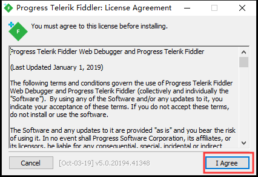
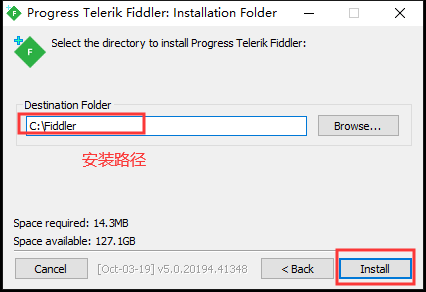
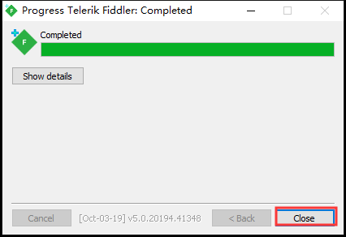
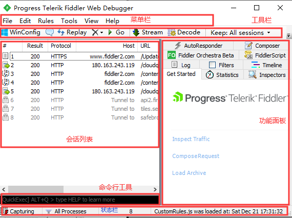
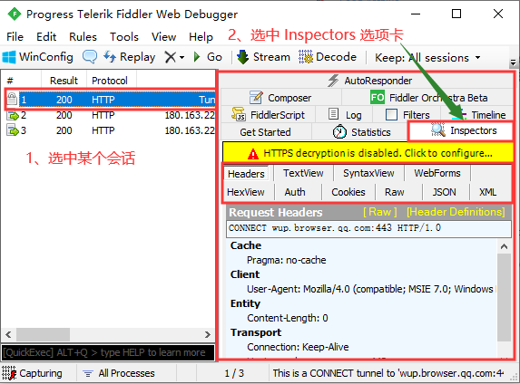
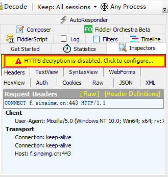
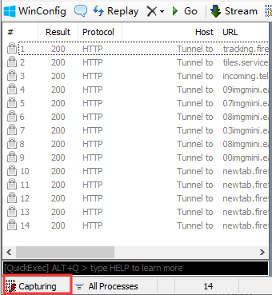

## Fiddler 下载和安装

### Fiddler 下载

Fiddler 官网：https://www.telerik.com/download/fiddler

### Fiddler 安装

### Fiddler 界面

1、菜单栏：通过菜单栏几乎可以启动 Fiddler 的所有功能。

2、工具栏：提供很多常见和常用的工具。

3、会话列表：会话列表也就是 Web Sessions 列表，显示捕捉到的每个 Session 的简短信息，平常都需要在这里选择一个或者多个 Session 后再进行操作。

4、功能面板：功能面板提供了很多选项卡，每个选项卡都提供了很多功能，其中最常用的是 Inspectors 选项卡。

5、命令行工具：也就是 QuickExec，可以输入简单的命令，比如输入 cls 可以清空所有的 Web Sessions。

6、状态栏：显示了 Fiddler 的部分配置信息。

#### Inspectors 选项卡

##### Headers
查看会话的请求头信息。

##### TextView

##### SyntaxView

##### WebForms

##### HexView

##### Auth

##### Cookies
查看会话的 Cookies 信息。
##### Raw
查看会话的完整请求信息。
##### JSON

##### XML

#### Web Sessions 会话列表

1、#：这是 Fiddler 生成的会话 ID ，最好是按照顺序排列。

2、Result：响应的状态码。

3、Protocol：使用的协议，HTTP 或者 HTTPS。

4、Host：服务器的主机名和端口号。

5、URL：URL 请求的路径。

6、Body：HTTP 响应中包含的字节数。

7、Caching：跟缓存相关的字段的值。

8、Content-Type：响应中的 Content-Type 的值。

9、Process：对应本地 Windows 中的进程。

### 配置 HTTPS

在界面显示如下信息：

HTTPS decryption is disabled. Click to configure...

如下图所示：

之所以出现如上的提示信息的原因是：没有启用 HTTPS 解密。

## Fiddler 使用

### Fiddler 抓包

Fiddler 抓包包括：开始抓包和结束抓包，有如下三种方式：

1、通过操作 File → Capture Traffic 菜单来开始或结束抓包；

2、单击界面左下角的 `Capturing` 按钮来开始或结束抓包，如下图所示：

3、通过 F12 快捷键来开始或结束抓包，推荐用该方式。

