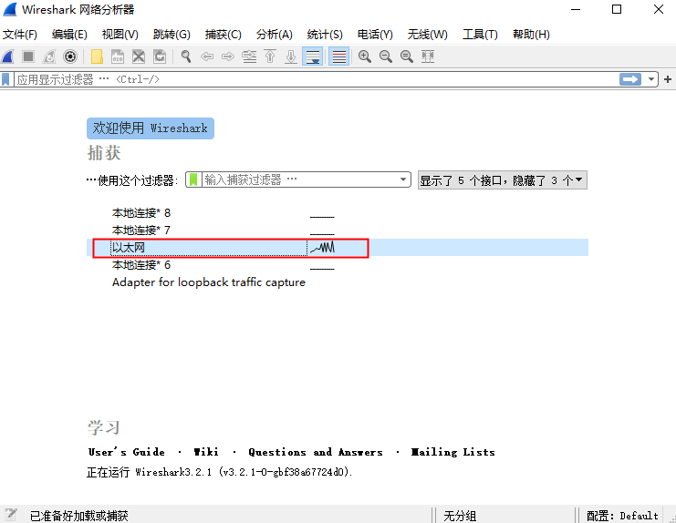
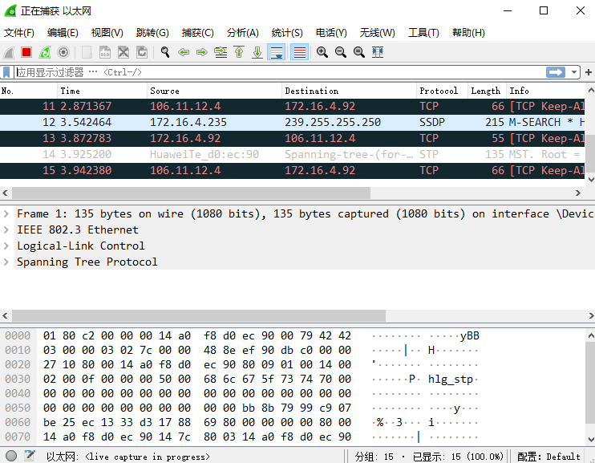

# Wireshark 使用

双击启动 `Wireshark` 然后选择网络接口，由于是台式机，所以选择以太网，直接双击即可，如下图所示：

上图中所显示的信息从上到下分布在 3 个面板中，每个面板包含的信息含义如下：
+ `Packet List 面板`：==上面部分==，显示 Wireshark 捕获到的所有数据包，这些数据包从 1 进行顺序编号。
+ `Packet Details 面板`：==中间部分==，显示一个数据包的详细内容信息，并且以层次结构进行显示。这些层次结构默认是折叠起来的，用户可以展开查看详细的内容信息。
+ `Packet Bytes 面板`：==下面部分==，显示一个数据包未经处理的原始样子，数据是以十六进制和 ASCII 格式进行显示。

然后是：