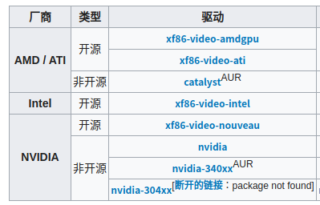

# 系统安装

## 准备工作

### 系统下载

https://www.archlinux.org/ → Download → tuna.tsinghua.edu.cn → https://mirrors.tuna.tsinghua.edu.cn/archlinux/iso/2020.08.01/

### 官方文档

https://wiki.archlinux.org/index.php

### 软件库

archlinux 软件库: https://www.archlinux.org/
archlinuxcn 软件库: https://repo.archlinuxcn.org/

### 在 `Linux` 中制作系统启动盘

1. 在Arch/Manjaro上安装 Etcher
```shell
sudo pacman -S etcher
```
2. 插入 U 盘

3. Select image - 选择镜像文件

4. Select drive - 选择 U 盘

5. 点击 Flash 开始制作

6. Flash Complete! 制作完成

## 安装过程

### 验证启动模式

```shell
ls /sys/firmware/efi/efivars
```

提示没有文件或目录，则是 BIOS，没有错误则为 EFI。

如果是在虚拟机中安装如何设置固件类型呢？
编辑虚拟机设置 → 选项 → 高级 → 固件类型 → UEFI 即可。

### 配置 `wifi-menu` 网络连接

1、通过网线连接上网则执行如下命令：

```shell
dhcpcd
```

2、如果是通过无线WiFi上网则执行如下命令：

```shell
wifi-menu
```

然后选择WiFi账号，输入WiFi密码，保存为WiFi配置文件。
WiFi配置文件保存目录为：`/etc/netctl/`

然后配置为开机启动:

```shell
netctl enable your_profile
```

然后重启系统就可以连接上网络了。

配置好网络连接之后，我们需要测试下网络连接情况：

```shell
ping -c 5 www.baidu.com
```

如果无法正常上网怎么办？可以尝试如下方式：

```shell
[root@sh examples]# nmcli dev wifi list
IN-USE  BSSID              SSID             MODE   CHAN  RATE        SIGNAL  BARS  SECURITY
        7C:CC:1F:2D:D9:E1  ChinaNet-999999  Infra  1     130 Mbit/s  80      ▂▄▆_  WPA1 
        2C:B2:1A:BC:DD:12  @PHICOMM_10      Infra  4     270 Mbit/s  65      ▂▄▆_  WPA1 WPA2
        D4:83:04:62:21:BE  66668888         Infra  11    270 Mbit/s  45      ▂▄__  WPA1 WPA2
[root@sh examples]# nmcli device wifi connect "ChinaNet-999999" password "12345678"
成功用 "wlp3s0da11033b-6f71-42b6-8ea5-ac1fe12f0bfa" 激活了设备 ""。
[root@sh examples]# 
```

如果以上两个命令都没有怎么办？

```shell
iwlist wlan0 scan | more
```

扫描无线网络的ID，比如：

```shell
TPGuest_B95B_2
TP-LINK_B95B_1
```

然后执行如下两个命令：

```shell
wpa_passphrase 网络ID "密码" > /etc/wpa_supplicant.conf
wpa_supplicant -B -i wlan0 -c /etc/wpa_supplicant.conf
```

配置好网络连接之后，我们需要测试下网络连接情况：

```shell
ping -c 5 www.baidu.com
```

这样基本上就可以上网了。

### 更新系统时钟

```shell
timedatectl set-ntp true
```

### 硬盘分区挂载

**查看硬盘情况**

```shell
fdisk -l
```

**使用 `cfdisk` 分区工具**

```shell
cfdisk /dev/sda
```

选择 `gpt` 并分成如下分区：

|           | Size     | Type             |
| --------- | -------- | ---------------- |
| /dev/sda1 | 512M     | EFI System       |
| /dev/sda2 | 10G      | Linux swap       |
| /dev/sda3 | 剩余部分 | Linux filesystem |

然后 → Write → yes (一定要输入) → Quit。

**查看分区情况**

```shell
fdisk -l
```

**分区格式化**

```shell
mkfs.fat -F32 /dev/sda1

mkswap /dev/sda2
swapon /dev/sda2

mkfs.ext4 /dev/sda3
```

**分区挂载**

```shell
mount /dev/sda3 /mnt

mkdir /mnt/boot

mount /dev/sda1 /mnt/boot
```

### 编辑镜像源文件

```shell
vim /etc/pacman.d/mirrorlist
```

打开文件后，在最上面添加如下镜像源地址

```shell
Server = https://mirrors.163.com/archlinux/$repo/os/$arch
Server = https://mirrors.tuna.tsinghua.edu.cn/archlinux/$repo/os/$arch
Server = https://mirrors.aliyun.com/archlinux/$repo/os/$arch
```

然后按 `:wq` 保存退出。

### 安装系统和软件

```shell
pacstrap /mnt base linux linux-firmware base-devel vim dhcpcd
```

### 写入配置文件

```shell
genfstab -U /mnt >> /mnt/etc/fstab
```

### 切换到新系统

```shell
arch-chroot /mnt
```

这样就进入到新安装好的系统里面了。

#### 设置时区

```shell
ln -sf /usr/share/zoneinfo/Asia/Shanghai /etc/localtime
```

#### 同步时间

```shell
hwclock --systohc
```

#### 本地化设置

```shell
vim /etc/locale.gen
```

分别输入 `/en_US` 和 `/zh_CN` 然后按 `n` 转到下一条，找到如下两行:

```shell
#en_US.UTF-8 UTF-8
#zh_CN.UTF-8 UTF-8
```

删除前面的 `#` ，然后 `:wq` 保存退出。

然后执行如下命令:

```shell
locale-gen
```

生成本地化信息。

#### 语言设置

```shell
echo LANG=en_US.UTF-8 >> /etc/locale.conf
```

或者按照如下步骤分步操作:

```shell
vim /etc/locale.conf
```

在编辑器里面添加:

```shell
LANG=en_US.UTF-8
```

然后保存退出。

#### 设置主机名

**编辑 `hostname` 文件**

```shell
echo "sh" >> /etc/hostname
```

**编辑 `hosts` 文件**

```shell
vim /etc/hosts
```

添加如下内容:

```shell
127.0.0.1   localhost
::1         localhost
127.0.1.1   sh.localdomain   sh
```

然后保存退出。

#### 设置 root 密码

```shell
passwd
a5s7sh4u
```

#### 安装固件驱动

| 命令                  | 范围                      |
| --------------------- | ------------------------- |
| pacman -S intel-ucode | 处理器为 Intel 执行该命令 |
| pacman -S amd-ucode   | 处理器为 AMD 执行该命令   |
| pacman -S os-prober   | 多系统并存需要执行该命令  |

#### 安装 GRUB EFI 启动管理工具

```shell
pacman -S grub efibootmgr
```

#### 安装 GRUB EFI 配置信息

```shell
grub-install --target=x86_64-efi --efi-directory=/boot --bootloader-id=GRUB
```

最后面的 `GRUB` 可以自定义，如果安装没问题的话，会输出如下信息:

```shell
Installing for x86_64-efi platform.
Installation finished. No error reported.
```

如果是 `BIOS` 的话，则是如下过程:

```shell
安装 grub 启动管理工具:

pacman -S grub

生成 BIOS 配置信息

grub-install --target=i386-pc /dev/sda
```

#### 生成 `grub.cfg` 配置文件

使用 `grub-mkconfg` 工具来生成 `/boot/grub/grub.cfg` 配置文件:

```shell
grub-mkconfig -o /boot/grub/grub.cfg
```

#### 配置网络管理工具

**安装网络管理工具**

```shell
pacman -S networkmanager dhcpcd
```

**如果是笔记本还需要安装如下工具**:

```shell
pacman -S iw wpa_supplicant dialog netctl
```

**注册并启动 `dhcp` 服务**

```shell
systemctl enable dhcpcd
systemctl start dhcpcd
```

**注册并启动 `networkmanager` 服务**

```shell
systemctl enable NetworkManager
systemctl start NetworkManager
```

#### 创建用户和用户组

**同时创建用户、用户组、目录**

```shell
useradd -m shan
or
useradd -m -g users -s /bin/bash shan
```

**分步骤创建用户、用户组、目录**

1. 新建用户组

```shell
sudo addgroup shan
```

2. 新建用户和目录

```shell
sudo useradd -d /home/shan -s /bin/bash -m shan
```
- -d 指定用户目录
- -s 指定用户shell
- -m 表示 home 目录，不存在则创建

3. 将新建的用户添加到用户组中

```shell
sudo usermod -a -G shan shan
```

**查看用户添加结果**

```shell
cat /etc/passwd
```


#### 设置用户密码

```shell
passwd shan
```


#### 给用户添加 `sudo` 权限

```shell
vim /etc/sudoers
```

在 `root ALL=(ALL) ALL` 行下面添加如下代码:

```shell
shan ALL=(ALL) ALL
```

然后输入 `:wq!` 进行**强制保存**，否则会提示说**该文件为只读( `/etc/sudoers readonly` )文件**。

#### 退出新系统

```shell
exit
```

### 卸载被挂载分区

```shell
umount -R /mnt
```

### 重启系统

```shell
reboot
```

重启之后，即可进入 `ArchLinux` 系统。

**以上内容参考视频**: https://www.bilibili.com/video/BV1Kz411B76D

# 系统软件

## 系统更新管理

### 添加 ArchLinuxCN 镜像源

```shell
sudo vim /etc/pacman.conf
```

然后在 `[multilib]` 下面增加如下配置:

```shell
[archlinuxcn]
Server = https://mirrors.aliyun.com/archlinuxcn/$arch
```

然后保存退出。

### 执行系统更新操作

```shell
sudo pacman -Syy
sudo pacman -Syyu - 强制系统更新
```


### 安装系统密钥环

```shell
sudo pacman -S archlinuxcn-keyring
```

安装过程中出现如下信息:

```shell
  -> 正在本地签名密匙 87F2E316E0ABC98B9DE8D4EF042FD810600954EF...
==> 错误： 87F2E316E0ABC98B9DE8D4EF042FD810600954EF无法在本地签署。
  -> 正在本地签名密匙 99399D88F7B752BF364CD485A85E3925A6211F05...
==> 错误： 99399D88F7B752BF364CD485A85E3925A6211F05无法在本地签署。
  -> 正在本地签名密匙 90403E12F4CE5E0E950E4AD2C96492E347202001...
==> 错误： 90403E12F4CE5E0E950E4AD2C96492E347202001无法在本地签署。
```

说明安装失败，如何解决？执行如下命令:

```shell
sudo pacman -Syu haveged
sudo systemctl enable haveged
sudo systemctl start haveged
sudo rm -rf /etc/pacman.d/gnupg
sudo pacman-key --init
sudo pacman-key --populate archlinux
sudo pacman-key --populate archlinuxcn
```

执行完成之后，再次执行上面的安装命令即可。

### 安装 AUR 助手

```shell
sudo pacman -S yay
sudo pacman -S yaourt
```

## 安装设备驱动

### 安装 xorg 窗口系统

```shell
sudo pacman -S xorg xorg-server xorg-xinit
```

`xorg` 服务是 `Linux` 桌面的硬件接口，所有的窗管都是 `x` 窗口的实现，所以必须安装该服务。

### 安装显卡驱动

**查看显卡型号**

```shell
lspci | grep VGA
```

例如显卡型号为： Intel Corporation HD Graphics 530

**查看独显型号**

```shell
lspci | grep 3D
```

例如独立显卡型号：NVIDIA Corporation GM107M [GeForce GTX 950M ]

根据显卡型号安装对应驱动,如下图所示:



| 显卡类型            | 对应驱动名称       |
| ------------------- | ------------------ |
| Intel               | xf86-video-intel   |
| Nvidia - Geforce7   | xf86-video-nouveau |
| Nvidia - Geforce6/7 | xf86-video-304xx   |
| AMD                 | xf86-video-ati     |

安装驱动时, 选择 `开源` 类型的驱动就对了。

由于我的笔记本只显示英特尔显卡驱动，所以要安装 Intel 显卡驱动:

```shell
sudo pacman -S xf86-video-intel
```

参考地址：

[https://wiki.archlinux.org/index.php/Xorg_(%E7%AE%80%E4%BD%93%E4%B8%AD%E6%96%87)](https://wiki.archlinux.org/index.php/Xorg_(简体中文))

### 安装输入设备驱动

```shell
sudo pacman -S xf86-input-libinput
```

如果是笔记本的话，还需要安装 `触摸板驱动` 程序:

```shell
sudo pacman -S xf86-input-synaptics
```

### 安装 sddm 登录管理器

```shell
sudo pacman -S sddm sddm-kcm

sudo systemctl enable sddm

sudo systemctl start sddm
```

附带界面切换快捷键:

| 快捷键          | 作用                     |
| --------------- | ------------------------ |
| CTRL + ALT + F2 | 图形界面切换到命令行界面 |
|                 | 命令行界面切换到图形界面 |

### 安装中文字体以免系统中文乱码

```shell
sudo pacman -S ttf-dejavu wqy-zenhei wqy-microhei wqy-microhei-lite wqy-bitmapfont
yay -S noto-fonts-sc   // 安装很慢(暂时不安装该字体)
```

### 安装 KDE 桌面和 KDE 应用

```shell
sudo pacman -S plasma kde-applications
```

### 安装声音管理器

```shell
sudo pacman -S alsa-utils pulseaudio pulseaudio-alsa
```

### 设置系统时间与 Windows 兼容

```shell
sudo pacman -S ntpdate
sudo ntpdate time.windows.com
sudo hwclock --localtime --systohc
```

然后重启之后就可以进入到桌面了。

# 桌面软件

## 桌面管理软件

### 设置中文界面

System  Settings - Regional Settings - Language - Add languages - 简体中文 - Add - 拖拽简体中文到最上面 - Apply - reboot

### 安装文件管理器

```shell
sudo pacman -S nautilus ranger
```

### 设置系统快捷键

settings - 键盘快捷键

### 安装 `yakuake` 下拉式终端

```shell
sudo pacman -S yakuake
```

### 安装 `neofetch` 系统信息查看软件

```shell
sudo pacman -S neofetch
```

或者安装 `screenfetch` 也可以用于系统信息查看。

## 安装终端美化

### 使用 zsh 终端

zsh 提供了命令、参数、软件包补全功能等众多功能。

#### 安装 zsh shell

```shell
sudo pacman -S zsh wget git
```


#### 安装 oh-my-zsh

```shell
wget https://github.com/robbyrussell/oh-my-zsh/raw/master/tools/install.sh
chmod +x install.sh
./install.sh
```


#### 切换到 zsh shell

chsh -s /bin/zsh → 当前用户切换 shell


## 安装桌面美化

## 安装应用软件

### 安装 `Git` 软件

```shell
sudo pacman -S git
```

### 谷歌浏览器

```shell
sudo pacman -S google-chrome
or
yay -S google-chrome
```

### 安装 VS Code

```shell
yay -S visual-studio-code-bin
or
sudo pacman -S code
```

### 安装和配置输入法

安装输入法:

```shell
sudo pacman -S fcitx fcitx-im fcitx-configtool
sudo pacman -S fcitx-googlepinyin
```

配置输入法:

```shell
sudo vim ~/.xprofile
```

添加如下内容:

```shell
export GTK_IM_MODULE=fcitx
export QT_IM_MODULE=fcitx
export XMODIFIERS="@im=fcitx"
```

**输入法问题？**

解决左边SHIFT键无法切换中英文:   右键Fcitx托盘 => 配置 => 全局配置 => 勾选显示高级设置 => 不勾选只在额外切换键取消激活后才是用它进行切换，且勾选启用输入法间切换。

解决中文输入时英文全角问题:   右键Fcitx托盘 => 配置 => 附加组件配置 => 勾选显示高级设置 => 不勾选全角字符。

解决云拼音不显示问题:   右键Fcitx托盘 => 配置 => 附加组件配置，找到云拼音支持，点击它右方的设置按钮，把谷歌设置成百度。


### 安装 WPS 软件

安装 WPS 软件包

```shell
yay -S wps-office
or
sudo pacman -S wps-office
```

安装 WPS 中文语言包

```shell
sudo pacman -S wps-office-mui-zh-cn
```

安装缺失字体

```shell
sudo pacman -S ttf-wps-fonts
```

解决无法输入中文问题：
sudo vim /usr/bin/wps，在第一行（#!/bin/bash）下面添加：
    export XMODIFIERS="@im=fcitx"
    export QT_IM_MODULE="fcitx"

### 安装 QT5

```shell
sudo pacman -S qt5-base qt5-doc qtcreator pkgconf
```


### 安装视频播放器

```shell
sudo pacman -S celluloid
```

### 安装 `Typora` 编辑器

```shell
sudo pacman -S typora
```

### 安装 `teamviewer` 软件

```shell
yay -S teamviewer
```

如果一直显示未连接，则请退出 `teamviewer`，执行如下代码:

```shell
sudo teamviewer --daemon enable
```

再打开试试，就可以显示连接信息啦。

### 安装 deepin-wine 软件

安装 `deepin-wine` 软件，是安装其它 `wine` 软件的基础，所以必须先安装。

```shell
sudo pacman -S deepin-wine
```

在安装时，出现如下错误信息：

```shell
ArchLinux 安装 deepin-wine 出现问题:
➜  ~ sudo pacman -S deepin-wine
正在解析依赖关系...
警告：无法解决 "lib32-gettext"，"deepin-wine" 的一个依赖关系
警告：无法解决 "lib32-libxcursor"，"deepin-wine" 的一个依赖关系
警告：无法解决 "lib32-fontconfig"，"deepin-wine" 的一个依赖关系
警告：无法解决 "lib32-mesa"，"deepin-wine" 的一个依赖关系
警告：无法解决 "lib32-lcms2"，"deepin-wine" 的一个依赖关系
警告：无法解决 "lib32-libjpeg6"，"deepin-wine" 的一个依赖关系
警告：无法解决 "lib32-libpulse"，"deepin-wine" 的一个依赖关系
警告：无法解决 "lib32-alsa-plugins"，"deepin-wine" 的一个依赖关系
警告：无法解决 "lib32-libxml2"，"deepin-wine" 的一个依赖关系
警告：无法解决 "lib32-libxrandr"，"deepin-wine" 的一个依赖关系
警告：无法解决 "lib32-libxi"，"deepin-wine" 的一个依赖关系
警告：无法解决 "lib32-glu"，"deepin-wine" 的一个依赖关系
警告：无法解决 "lib32-libldap"，"deepin-wine" 的一个依赖关系
```

解决问题:

使用文本编辑器打开 /etc/pacman.conf 找到

#[multilib]
#Include = /etc/pacman.d/mirrorlist

将之修改为

[multilib]
Include = /etc/pacman.d/mirrorlist

然后执行
sudo pacman -Syyu

之后就能正常安装了。


### 安装 QQ 和 TIM

sudo pacman -S deepin.com.qq.im deepin.com.qq.office


### 安装 composer 软件

```shell
sudo pacman -S composer
```


```shell
composer config -g repo.packagist composer https://mirrors.aliyun.com/composer/
```


### 安装 `NeoVim` 软件

```shell
sudo pacman -S neovim
```


### 安装屏幕录像软件

```shell
sudo pacman -S simplescreenrecorder
```


### 安装按键回显软件

```shell
sudo pacman -S screenkey
```

### 安装 `vmware` 虚拟机

```shell
sudo pacman -S vmware-workstation
```

```shell
激活许可证:
UY758-0RXEQ-M81WP-8ZM7Z-Y3HDA
VF750-4MX5Q-488DQ-9WZE9-ZY2D6
UU54R-FVD91-488PP-7NNGC-ZFAX6
YC74H-FGF92-081VZ-R5QNG-P6RY4
YC34H-6WWDK-085MQ-JYPNX-NZRA2
```


相关错误解决：

未知的公共密匙 5DECDBA89270E723
gpg --keyserver keyserver.ubuntu.com --recv 5DECDBA89270E723

https://aur.archlinux.org/
----------------------------------------------------------------
Could not open /dev/vmmon: No such file or directory. Please make sure that the kernel module 'vmmon' is loaded.”

解决办法：
1、加载 vmmon 模块，命令：sudo modprobe -a vmw_vmci vmmon

2、如果出现如下警告：
	modprobe: WARNING: Module vmmon not found in directory /lib/modules/4.18.16-arch1-1-ARCH

3、确认linux内核的版本
	uname -r
	→ 5.7.14-1-MANJARO
4、安装依赖linux-headers，命令：sudo pacman -S linux-headers
	→ 然后选择 linux57-headers 进行安装。

5、再执行加载 vmmon 模块命令，该故障排除。
------------------------------------------------------------------------------
manjaro linux 使用 vmware 时 NAT 无法联网问题解决
报错如下：

Could not connect 'Ethernet0' to virtual network '/dev/vmnet8'. More information can be found in the vmware.log file.

处理方法：

sudo touch /etc/vmware/x
sudo vmware-networks --migrate-network-settings /etc/vmware/x
sudo rm /etc/vmware/x

使用下面的命令添加vmnet8，选择为nat
vmware-netcfg

然后执行
sudo modprobe vmnet
sudo vmware-networks --start

------------------------------------------------------------------------------
Manjaro 安装 VMware Tools

1、卸载 open-vm-tools
sudo pacman -R open-vm-tools

2、下载 vmwaretools 补丁
git clone https://github.com/rasa/vmware-tools-patches.git

3、进入vmware-tools-patches目录
cd vmware-tools-patches

4、运行补丁
sudo ./patched-open-vm-tools.sh

5、重启
reboot


### 同步数据库报错解决办法

出现如下错误信息：

```shell
:: 正在同步软件包数据库...
错误：无法升级 core (无法锁定数据库)
错误：无法升级 extra (无法锁定数据库)
错误：无法升级 community (无法锁定数据库)
错误：无法升级 multilib (无法锁定数据库)
错误：无法升级 archlinuxcn (无法锁定数据库)
错误：无法升级 sublime-text (无法锁定数据库)
错误：未能成功同步所有数据库
```

解决办法
删除文件: `/var/lib/pacman/db.lck`
接着再次输入更新命令 `sudo pacman -Syyu` 即可同步成功。


### 安装 Aria2 下载软件

```shell
sudo pacman -S aria2
```


### 结尾


