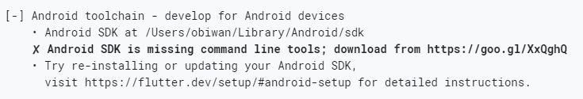
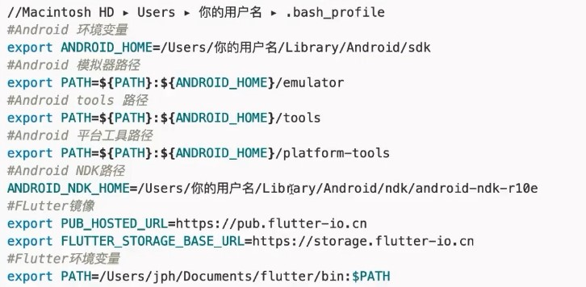

在 Mac 中搭建 Flutter 开发环境的官方参考文档：https://flutter.dev/docs/get-started/install/macos

**开发环境搭建**

- 系统要求
- 设置 Flutter 镜像（非必须）
- 获取 Flutter SDK
- iOS 开发环境设置
- Android 开发环境设置

系统要求

在 Mac 上要安装并运行 Flutter 需要满足以下最低要求：

- 操作系统：macOS（64bit）
- 磁盘空间：700MB（不包括 XCode 或者 Android Studio 的磁盘空间）
- 工具：Flutter 依赖下面这些命令行工具：

```
bash
curl
git 2.x
mkdir
rm
unzip
which
```

Mac 系统需要安装的命令参考：https://flutter.dev/docs/get-started/install/macos

# 设置 Flutter 镜像（非必须）

由于在国内访问 Flutter 可能会受到限制，Flutter 官方为中国开发者搭建了临时镜像，大家可以将入选环境变量加入到用户环境变量中：

 

```
//Macintosh HD > Users > 你的用户名 > .bash_profile
export PUB_HOSTED_URL=https://pub.flutter-io.cn
export FLUTTER_STORAGE_BASE_URL=https://storage.flutter-io.cn
```

注意：此镜像为临时镜像，并不能保证一直可用，大家可以从 [Using Flutter in China](https://flutter.dev/community/china) 上获得有关镜像服务器的最新动态。

# 获取 Flutter SDK

1、点击 [Flutter 官网](https://flutter.dev/docs/development/tools/sdk/releases?tab=macos) 下载其最新可用的安装包，比如 Stable channel (macOS) 的最新版本。

2、解压安装包到我们想要安装的位置目录，如：

 

```
cd ~/development
unzip ~/Downloads/flutter_macos_v1.12.13+hotfix.8-stable.zip
```

3、添加 Flutter 相关工具到 Path 变量中：

 

```
export PATH="$PATH:`pwd`/flutter/bin"
```

此代码只能暂时针对当前命令行窗口设置 PATH 环境变量，要想永久的将 Flutter 添加到 PATH 中请参考如下做法：

 

```
cd ~
vim .bash_profile
```

然后添加 Flutter 的 bin 目录：

 

```
export PATH=/Users/用户名/Documents/flutter/bin:$PATH
```

然后保存文件。

# 运行 flutter doctor

上面 PATH 配置完成之后，需要关闭终端然后重新打开，然后运行：

 

```
flutter doctor
```

该命令检查你的环境并在终端窗口中显示报告。

Dart SDK 已经捆绑在 Flutter 里了，没有必要单独安装。

仔细检查命令行输出以获取可能需要安装的其他软件或者进一步需要执行的任务（以粗体显示），比如：



一般的错误会是 XCode 或者 Android Studio 版本太低、或者没有 ANDROID_HOME 环境变量等，可参考一下环境变量的配置来检查你的环境变量：



第一次运行一个 flutter 命令（比如：flutter doctor）时，它会下载它自己的依赖项并自行编译，以后再运行就会快很多。

# iOS 开发环境设置

## 安装 XCode