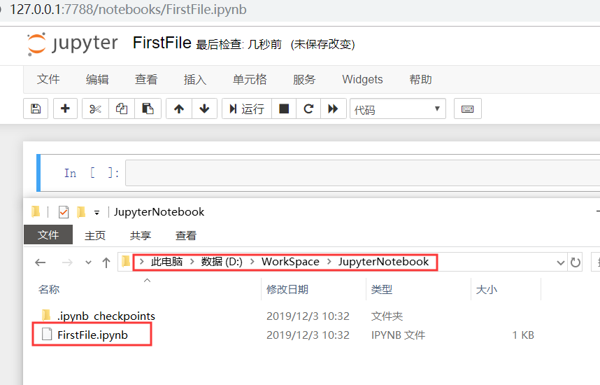

# Jupyter 配置

## 配置工作目录

生成 Jupyter 的运行配置。

```shell
C:\Users\Administrator\Desktop
λ jupyter notebook --generate-config
```

生成配置文件，地址如下：

```shell
Writing default config to: C:\Users\Administrator\.jupyter\jupyter_notebook_config.py
```

打开地址进行编辑：

```shell
#c.NotebookApp.notebook_dir = ''
修改为
c.NotebookApp.notebook_dir = 'D:/WorkSpace/JupyterNotebook'
```

然后重启 Jupyter 服务，此时新建的 Python3 文件保存地址如下图所示：



