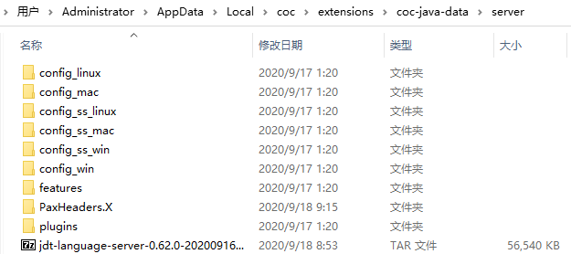
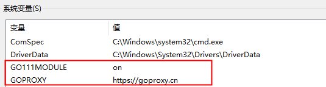

# 软件安装

## 安装 `NeoVim`

打开 `https://github.com/neovim/neovim/releases` 进行下载。然后进行解压缩，把 `C:\NeoVim\bin` 加入系统的 `Path` 环境变量，方便通过 `cmd` 和 `cmder` 启动编辑器。
用户手册 `https://neovim.io/doc/user/`
配置文件地址 `https://github.com/neovim/neovim/wiki/Installing-Neovim` 查找 `%userprofile%\AppData\Local\nvim\init.vim` 即可看到，配置文件对应的地址为 `C:\Users\Administrator\AppData\Local\nvim\init.vim` 文件。

## 安装 `vim-plug` 插件管理器

打开 `https://github.com/junegunn/vim-plug` 查看安装方式，在 `Windows(PowerShell)` 平台的安装代码如下：

```shell
iwr -useb https://raw.githubusercontent.com/junegunn/vim-plug/master/plug.vim |`
    ni "$env:LOCALAPPDATA/nvim-data/site/autoload/plug.vim" -Force
```

安装后的最终地址为：`C:\Users\Administrator\AppData\Local\nvim-data\site\autoload\plug.vim` 文件。

## `NeoVim` 配置文件

`NeoVim` 配置文件的位置在哪里？

配置文件的路径为: `C:\Users\Administrator\AppData\Local\nvim\init.vim`。

为了方便管理插件和配置文件，我们在 `C:\Users\Administrator` 创建一个 `NeoVim` 的文件夹，在 `NeoVim` 创建 `plugged` 目录，用于存放插件；给 `init.vim` 创建个快捷方式，也放在 `NeoVim` 目录下。

## `Win 10` 使用命令别名

在 `Win 10` 中有一条命令 `doskey` 用来给操作取别名，比如：

```shell
doskey clear=cls
doskey vim=nvim
doskey nvc=nvim %USERPROFILE%\AppData\Local\nvim\init.vim
```

但是，这个配置过程只对当前 `cmd` 窗口有效，新开的 `cmd` 是无效的。

所以，如何配置成全局的呢？

### 配置全局别名

1. 在任意位置，创建 `.bat` 文件，文件名任意取，比如在 `C:\Users\Administrator` 创建 `fastkey.bat`，在文件中添加如下命令：

```shell
@doskey clear=cls
@doskey vim=nvim $*
@doskey nvc=nvim %USERPROFILE%\AppData\Local\nvim\init.vim
```
说明：
 - 等号左边是右边的别名
 - `$*` 表示该命令可能有其它参数
 - `@` 表示执行该命令时，不显示该命令本身
 - `%USERPROFILE%` 的值就是 `C:\Users\Administrator`

2. 编写 `.reg` 文件，文件名任意取，比如在 `C:\Users\Administrator` 创建 `fastkey.reg`，在该文件中添加如下命令：

```shell
Windows Registry Editor Version 5.00

[HKEY_CURRENT_USER\Software\Microsoft\Command Processor]
"AutoRun"="%USERPROFILE%\\fastkey.bat"
```
 - `%USERPROFILE%` 的值就是 `C:\Users\Administrator`

3. 执行 .reg 文件进行导入，然后删除。

### 别名的导入导出

导出操作：

```shell
doskey /macros:all >> my.alias
```

导出的文件在当前窗口所在目录，导出后的文件内容如下所示：

```shell
[cmd.exe]
    clear=cls
    vim=nvim
    nvc=nvim C:\Users\Administrator\AppData\Local\nvim\init.vim
```

导入操作：

```shell
doskey /macros:all=my.alias
```

## `Win 10` 最好的终端

首先，把 `Windows Update` 启动；

然后，通过应用商店搜索 `Windows Terminal` 进行安装，它的 `GitHub` 地址为：`https://github.com/microsoft/terminal`；

最后，把 `Windows Update` 关闭；

### 给终端做点配置

文档地址：`https://docs.microsoft.com/zh-cn/windows/terminal/`

#### 命令面板

菜单 → 设置 ，在 ` "keybindings"` 中添加如下配置：

```shell
{ "command": "commandPalette", "keys": "ctrl+shift+p" }
```

然后就像 `vscode` 一样可以打开面板了。

#### 标签切换

```shell
Ctrl + Tab : 下一个标签
Ctrl + Shift + Tab : 上一个标签
Ctrl + Shift + 1 : 新建 Powser Shell 标签
Ctrl + Shift + 2 : 新建 CMS 标签
Ctrl + 滚轮 : 调整字体大小
```


## 启动 `vim-plug` 插件管理器

在当前用户目录下创建 `NeoVim\plugged` 目录结构。

然后打开 `init.vim` 配置文件，添加如下代码：

```shell
" 插件管理 {{{
    call plug#begin("~/NeoVim/plugged/")
    call plug#end()
" }}}
```

即可启用 `vim-plug` 插件管理器。

# 安装插件

为了方便通过 `sublime` 来编辑 `hosts` 文件，需要把 `sublime` 配置到 `Path` 环境变量，也就是把 `C:\Sublime Text 3` 添加到 `Path` 环境变量；

然后添加如下别名：

```shell
@doskey sublhosts=subl %SystemRoot%\System32\drivers\etc\hosts
```

在 `hosts` 文件添加如下域名解析：

```shell
151.101.228.133   raw.githubusercontent.com
#199.232.68.133   raw.githubusercontent.com
#199.232.68.133   user-images.githubusercontent.com
#199.232.68.133   avatars2.githubusercontent.com
#199.232.68.133   avatars1.githubusercontent.com
```

## 安装 `coc.nvim` 代码补全插件

`coc.nvim` 插件地址 `https://github.com/neoclide/coc.nvim`
该插件安装的步骤如下：
1、安装 `nodejs (https://nodejs.org/en/download/)` ≥ 10.12 版本和 `yarn` 

`yarn` 官网地址：`https://classic.yarnpkg.com/`

`yarn`下载地址 `https://classic.yarnpkg.com/zh-Hans/docs/install/`

验证安装结果：

```shell
node -v
yarn --version
```

`node` 和 `yarn ` 安装完成之后，会自动加入 `Path` 环境变量。

2、在 `vim-plug` 添加如下代码：

```shell
Plug 'neoclide/coc.nvim', {'branch': 'release'}
```
然后启动 `NeoVim` 执行如下命令：
```shell
:PlugInstall
```
即可进行 `coc.nvim` 插件的安装。

`coc` 安装的模块保存位置为：

`C:\Users\Administrator\AppData\Local\coc\extensions\node_modules`

### 配置 `前端` 代码补全插件
这里是指包括 `HTML`、`CSS` 和 `JavaScript`、`TypeScript` 四个方面的代码补全：

### 配置 `PHP` 代码补全插件

```shell
npm i intelephense -g
```

```shell
coc-phpls
```

#### 配置 `Laravel` 代码补全插件


### 配置 `Python` 代码补全插件

```shell
pip install pylint
pip install jedi
pip install pynvim
```

### 配置 `Java` 代码补全插件

首先，安装 `jdk-8u261-windows-x64.exe` 软件；

然后，配置 `Java` 环境变量：

|           |                                          |      |
| --------- | ---------------------------------------- | ---- |
| JAVA_HOME | C:\Java\jdk1.8.0_261                     |      |
| classpath | .;%JAVA_HOME%\lib                        |      |
| Path      | %JAVA_HOME%\bin<br />%JAVA_HOME%\jre\bin |      |

接着，安装 `coc-java`；

下一步，编辑 `.java` 文件: 这一步会自动下载 `jdt.ls` 服务。下载时，下载失败，提示如下信息：

```shell
[coc.nvim] Download jdt.ls failed, you can download it at https://download.eclipse.org/jdtls/snapshots/?d
```

然后解压缩到 `C:\Users\Administrator\AppData\Local\coc\extensions\coc-java-data\server` 目录下，如下图所示：



然后用 `NeoVim` 编辑 `.java` 文件，提示如下错误信息：

```shell
[coc.nvim] The "java" server crashed 5 times in the last 3 minutes. The server will not be restarted.
```

调试输出：

```shell
https://github.com/neoclide/coc.nvim/wiki/Debug-language-server#using-output-channel
```


配置项参考地址：

```shell
https://github.com/neoclide/coc-java
```


### 配置 `Go` 代码补全插件

安装 `Go` 软件 ： 会自动把 `C:\Go\bin` 加入 `Path` 环境变量；

配置 `Go` 环境变量 ：

```shell
GO111MODULE : on
GOPROXY = https://goproxy.cn
```

如下图所示：



安装 `gopls`：

```shell
go get golang.org/x/tools/gopls@latest
```

打开 `coc.nvim` 配置文件添加如下配置：

```shell
	{
		"languageserver": {
			"golang": {
				"command": "gopls",
				"rootPatterns": ["go.mod", ".vim/", ".git/", ".hg/"],
				"filetypes": ["go"]
			}
		}
	}
```

然后安装 `coc-go` 插件；

创建项目：

```shell
go mod init 项目
```

安装其它库文件：

```shell
go get github.com/beego/bee
```

示例代码：

```shell
package main
fun main(){
	beego.Run()
}
```

```shell
go get -u github.com/gin-gonic/gin
```

示例代码：

```shell
package main
fun main(){
	run := gin.Default()
	run.GET()
	run.Run()
}
```

### 配置 `C` 和 `C++` 代码补全插件
### 配置 `C#` 代码补全插件

## 安装 `NERDTree` 目录树插件

该插件的地址为 `https://github.com/preservim/nerdtree`

```shell
Plug 'preservim/nerdtree'
```

打开命令 `:NERDTree`
常用配置如下：

```shell
map <C-n> :NERDTreeToggle<CR>
let g:NERDTreeDirArrowExpandable = '▸'
let g:NERDTreeDirArrowCollapsible = '▾'
```


## 安装 `vim-airline` 状态栏插件

插件地址: `https://github.com/vim-airline/vim-airline`

```shell
Plug 'vim-airline/vim-airline'
Plug 'vim-airline/vim-airline-themes'
```


## 安装 `fzf` 文件查找插件

## 安装 `ctags` 代码跳转插件

插件地址 `https://github.com/universal-ctags/ctags`


