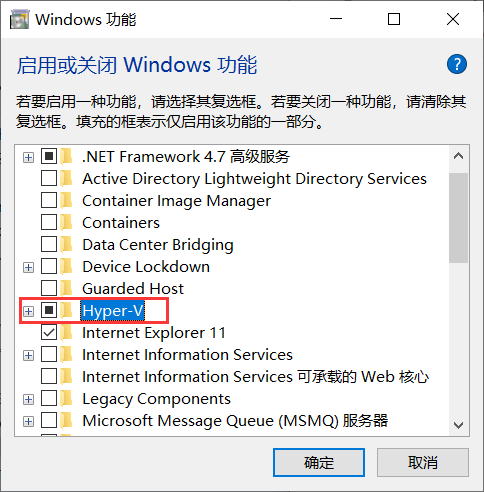

## Vagrant 软件
Vagrant 百度百科：https://baike.baidu.com/item/Vagrant/1321946
Vagrant 是一个基于 Ruby 的工具，用于创建和部署虚拟化开发环境。它使用 Oracle 的开源 VirtualBox 虚拟化系统，使用 Chef 创建自动化虚拟环境。
Vagrant 下载地址：https://www.vagrantup.com/downloads.html
由于宿主机为 ==Windows 10== 所以下载 ==Windows 64-bit== 版本。
Vagrant 安装：安装过程很简单，下一步直到结束即可。
Vagrant 镜像地址： https://app.vagrantup.com/boxes/search 
查看所有的 boxes ：http://www.vagrantbox.es/
验证 Vagrant 安装是否成功：
```shell
vagrant --version
Vagrant 2.2.6
```
在正式使用 Vagrant 之前，需要先开启 Windows 的 Hyper-V 功能，否则会出现如下错误：
```shell
The Hyper-V cmdlets for PowerShell are not available! Vagrant
requires these to control Hyper-V. Please enable them in the
"Windows Features" control panel and try again.
```
开启 Windows 的 Hyper-V 功能过程：控制面板 → 程序和功能 → 启用或关闭 Windows 功能 → 选中 Hyper-V → 确定，如下图所示：

安装完成之后，需要重启电脑。
创建 Laravel 文件夹：

```shell
C:\Users\Administrator\Desktop
λ cd D:
D:\

C:\Users\Administrator\Desktop
λ D:

D:\
λ mkdir Laravel
```
执行初始化命令：
```shell
λ cd Laravel

D:\Laravel
λ vagrant init laravel/homestead
A `Vagrantfile` has been placed in this directory. You are now
ready to `vagrant up` your first virtual environment! Please read
the comments in the Vagrantfile as well as documentation on
`vagrantup.com` for more information on using Vagrant.
```
这一步相当于创建 laravel/homestead 的描述信息,这些信息在 Vagrantfile 文件内。
执行创建虚拟机命令：

```shell
D:\Laravel
λ vagrant up
```
此命令为下载 box base，可以理解为 docker 的 image 镜像。此过程需要很久，因为墙的原因。下载完成后会自动安装，只需要等待就好了。
在下载的过程中，我们可以看到如下信息：

```shell
D:\Laravel
λ vagrant up
Bringing machine 'default' up with 'virtualbox' provider...
==> default: Box 'laravel/homestead' could not be found. Attempting to find and install...
    default: Box Provider: virtualbox
    default: Box Version: >= 0
==> default: Loading metadata for box 'laravel/homestead'
    default: URL: https://vagrantcloud.com/laravel/homestead
==> default: Adding box 'laravel/homestead' (v8.2.1) for provider: virtualbox
    default: Downloading: https://vagrantcloud.com/laravel/boxes/homestead/versions/8.2.1/providers/virtualbox.box
==> default: Box download is resuming from prior download progress
    default: Download redirected to host: vagrantcloud-files-production.s3.amazonaws.com
    default: Progress: 0% (Rate: 159k/s, Estimated time remaining: 3:39:07)
```
在信息中，有一条信息：
```shell
default: Downloading: https://vagrantcloud.com/laravel/boxes/homestead/versions/8.2.1/providers/virtualbox.box
```
这个便是真实下载地址，我们复制该地址直接用迅雷进行下载，如果有香港服务器，则通过香港服务器进行下载速度更快。
Vagrant 相关操作命令：
1、列出所有盒子：

```shell
vagrant box list
```
2、添加盒子：
```shell
D:\Laravel
λ vagrant box add Laravel ..\virtualbox.box
==> box: Box file was not detected as metadata. Adding it directly...
==> box: Adding box 'Laravel' (v0) for provider:
    box: Unpacking necessary files from: file://D:/virtualbox.box
    box:
==> box: Successfully added box 'Laravel' (v0) for 'virtualbox'!
```
3、初始化盒子
```shell
D:\
λ vagrant init Laravel

结果如下：
A `Vagrantfile` has been placed in this directory. You are now
ready to `vagrant up` your first virtual environment! Please read
the comments in the Vagrantfile as well as documentation on
`vagrantup.com` for more information on using Vagrant.
```
4、打开 VirtualBox ，然后启动盒子
```shell
D:\Laravel
λ vagrant up
Bringing machine 'default' up with 'virtualbox' provider...
==> default: Importing base box 'Laravel'...
==> default: Matching MAC address for NAT networking...
==> default: Setting the name of the VM: Laravel_default_1571379148045_44673
==> default: Clearing any previously set network interfaces...
==> default: Preparing network interfaces based on configuration...
    default: Adapter 1: nat
==> default: Forwarding ports...
    default: 22 (guest) => 2222 (host) (adapter 1)
==> default: Booting VM...
==> default: Waiting for machine to boot. This may take a few minutes...
    default: SSH address: 127.0.0.1:2222
    default: SSH username: vagrant
    default: SSH auth method: private key
    default: Warning: Connection aborted. Retrying...
    default: Warning: Connection reset. Retrying...
    default:
    default: Vagrant insecure key detected. Vagrant will automatically replace
    default: this with a newly generated keypair for better security.
    default:
    default: Inserting generated public key within guest...
    default: Removing insecure key from the guest if it's present...
    default: Key inserted! Disconnecting and reconnecting using new SSH key...
==> default: Machine booted and ready!
==> default: Checking for guest additions in VM...
==> default: Mounting shared folders...
    default: /vagrant => D:/Laravel

D:\Laravel
λ
```
如果启动失败，记得修改 Vagrantfile 文件，把 config.vm.box 的值修改为自己的 box 的名称。
启动不起来，出现如下错误：

```shell
==> default: Waiting for machine to boot. This may take a few minutes...
    default: SSH address: 127.0.0.1:2200
    default: SSH username: vagrant
    default: SSH auth method: private key
Timed out while waiting for the machine to boot. This means that
Vagrant was unable to communicate with the guest machine within
the configured ("config.vm.boot_timeout" value) time period.

If you look above, you should be able to see the error(s) that
Vagrant had when attempting to connect to the machine. These errors
are usually good hints as to what may be wrong.

If you're using a custom box, make sure that networking is properly
working and you're able to connect to the machine. It is a common
problem that networking isn't setup properly in these boxes.
Verify that authentication configurations are also setup properly,
as well.

If the box appears to be booting properly, you may want to increase
the timeout ("config.vm.boot_timeout") value.
```
启动时，出现如下错误：
```shell
VBoxManage.exe: error: VT-x is not available (VERR_VMX_NO_VMX)
```
解决办法：
- 关闭 ==Windows== 功能中的 ==Hyper-V== 功能（不一定需要操作该步骤）；
- 使用管理员身份打开终端；
- 输入 ==bcdedit== 并回车，找到 ==hypervisorlaunchtype== 选项，发现其值为 ==Auto==；
- 输入命令 ==bcdedit /set hypervisorlaunchtype off== 并回车；
- 重启电脑；

问题解决。
5、登录虚拟机
在 VirtualBox 输入 vagrant vagrant 即可登录。
6、关闭虚拟机

```shell
D:\Laravel
λ vagrant halt
==> default: Attempting graceful shutdown of VM...
```
7、删除虚拟机
```shell
D:\Laravel
λ vagrant destroy
    default: Are you sure you want to destroy the 'default' VM? [y/N] y
==> default: Destroying VM and associated drives...
```
8、删除盒子

```shell
D:\Laravel
λ vagrant box list
Laravel (virtualbox, 0)

D:\Laravel
λ vagrant box remove Laravel
Removing box 'Laravel' (v0) with provider 'virtualbox'...

D:\Laravel
λ vagrant box list
There are no installed boxes! Use `vagrant box add` to add some.

D:\Laravel
λ
```
命令参考：
https://www.cnblogs.com/lovebing/p/9509923.html
https://www.jianshu.com/p/30c347c31fe0
https://www.jianshu.com/p/cddfaea07ccc

