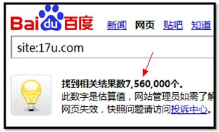
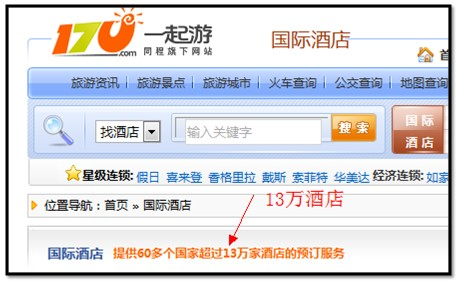
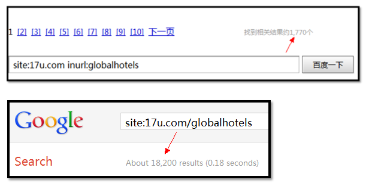

SEO要数据化，目前在国平和光年论坛的推动下，已经有不少朋友开始开始认识到SEO数据分析的重要性。其实SEO的数据分析，并不是什么时髦新概念了，很早开始，就有一批“专家”们提倡，“我们要分析数据，分析对手来做SEO”。

回头看看以前的那些SEO数据分析。有这么几个常见的条目

1.首页PR

2.Alexa排名

3.site收录数

4.首页快照

5.外链数量

6.核心关键词排名

以及等等等…

先来点评一下，为什么以往的SEO数据分析，不能做到从数据驱动SEO。我们逐条分析一下以往做条目。

1、在其他因素不变的情况下，PR高，流量一定高吗？很显然不是，而且还只是首页的PR值，对于任意一个网站来说，首页的流量仅仅是一小部分，对于超级大站来说，首页的流量所占比例小到可以忽略。（由于基数大，小比例的数据也比很多网站可观了）。因为第一条的数据，完全没必要分析。

2、alexa的数据还有一定的参考性，但是对国内网站来说，几乎可以无视，除了搞IT的，基本没人会装这货。Alexa统计的流量是所有流量，并非单纯的SEO流量，所以对SEO没太大关系，不过alexa的数据获取比较容易，就作为一个参考吧。

3、site收录准不准先不说。问题是,site出来的数据有什么意义呢？如果我一个网站有1个亿的页面，我site出来100万，是好还是坏？我一个网站有1万个页面，我site出来是1万，是好还是坏。 因此，除了site的数据，你至少得知道这个网站有多少页面量，否则site的数据毫无意义。

4、首页快照，网页有更新了，爬虫可能拍个照，快照时间更新一下。更多时候你页面动都没动。你指望快照变化对你SEO有什么影响呢？而且和首页PR同理，首页只是一个页面而已，没那么特殊。

5、外链数量，OMG，外链为王，外链数量肯定是重要的。外链真的是越多越好吗？有的query很明显排名第1的比排名第10的外链少得多的多。其实外链的整体质量很难衡量，反正你也统计不全，何必要用这个数量作为一个结果，如果相关外链多，则排名会提高，这不是我说的，是Google、百度说的。所以我们统计排名这个直接因素就好了。

6、说到排名，这边说说核心关键词的排名与网站整体排名的问题。相信各位站长手头都有自己的网站，看看流量报告吧，那些核心关键词能带来的流量占所有流量 的比例是多少？但是一般做SEO优化的时候，大家都习惯于把资源集中在几个核心词上，而大量的关键词流量，都是属于没人要的，随便分配一些资源过去，流量就上来了。只看核心词的排名做SEO，属于捡了芝麻，丢了西瓜。两手都要抓，两手都要硬，平均分配资源，才能收益最大化。

从上几个数据我们可以看出，过往的SEO数据分析，分析的数据大都是不靠谱，不准确的。自然对SEO没什么影响，而且从这些数据中，也很难发现核心问题。SEO数据分析，往往就成了一个“噱头”，花了大量时间精力，却连一点效果和指导也没有。

那如何做SEO的数据分析，我这边先推荐一些前人的智慧：

（前阿里巴巴SEO人员）国平

**详解《光年SEO日志分析系统2.0》**

**网页加载速度是如何影响SEO效果的**

（前天极网SEO人员）废小米

**百度收录抽查**

**任重而道远-it垂直类门户搜索引擎关键词排名对比**

虽然有些文章很老，但是到现在已经很有指导性作用。我这边也先不借用谁的理论，我们从事实出发，好好回想一些用户是如何通过搜索引擎来到我们网站的？

1、用户在搜索框中输入一个关键词

2、用户在搜索结果页面中阅读大量结果

3、用户点击进入某个它满意的结果

OK，这是最简单的一次用户访问，事实上用户还有一些其他情况，本文先不展开讨论。

我们还是针对每一条用户操作，设定一些问题，然后再对应的问题，我们来找一些数据出来解决这个问题。

1、我们想知道用户搜索了什么关键词？这个关键词的目的是什么？我们的页面能不能满足用户的这种需要呢？

2、我们的页面，如何出现在搜索结果页面中？

3、如何在搜索结果页面中脱颖而出，让用户点击你？

如果把这三点做好，我相信一个网站的SEO流量绝对不会低。我们如何开始做？（夜息注：本文没有一步速成的方法，如果想一步登天可以绕道）

就拿第二个问题来看，我们的页面，如何出现在搜索结果中？

这是一个看似很愚蠢的问题，“哈哈，不就是收录的问题吗？”，有人会说，“我的网站早就被百度收录了，但是什么流量也没有”。我们来看看下面这个例子。

这个网站百度收录有7百多万页面，看起来不错，我们到这个网站上去看看。

有一个叫“国际酒店”的频道，上面写有13万酒店预订服务信息。换句话说，我至少有13万个不重复页面，来描述这些酒店信息。

百度收录1770，Google收录18200，如果算上一些索引页，那总体收录比率只有1%，甚至更少。(夜息注：inurl 的查询方法并不是很准确，所以还有待考证，本文只是做一个例子)

再换言之，如果我在百度，Google上搜索大部分的国际酒店预订信息，这个网站的页面可能不会出来在搜索结果中。因为根本还没被收录。

看到一个10年的数据，说中国10年的时候有5000多万人次出境。如果估算30%人需要订酒店入住，那这就是一个巨大的流量机会了。很显然，这个网站这这块细分蛋糕上还有很大的提升空间。如果作为SEO集中精力解决这个频道的收录问题，相信对网站业务有很明显的提升。

如何解决收录问题，我相信很多人已经很有办法了。我也就不老声长谈了，很多东西都能在上面推荐的文章中找到，就总结一下我自己分析的SEO数据：

某频道爬虫每日抓取量

某频道爬虫每日不重复抓取量

某频道爬虫单页下载时间

某频道网页响应速度

某频道每日爬虫到访次数

某频道Top目录

某频道收录比例抽查

某频道响应代码统计

依靠这些数据，我们很清楚的就能了解到某频道的网站收录情况如何，问题出在哪里。

是压根没爬到？还是爬太少？还是爬不全？还是页面质量太低？还是服务器配置错了？还是服务器Down掉了？一切问题，都逃不出这些数据的法眼。