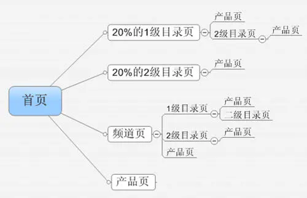
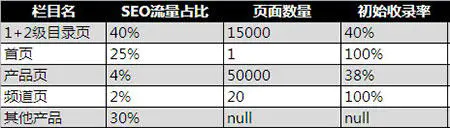
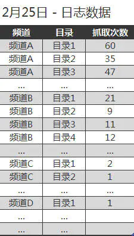
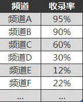
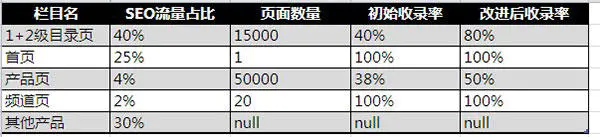

距离上一篇SEO的数据分析已经过了好久了，最近觉得应该写一些实际点的内容看看 SEO 到底怎么做。 先明确一些基本点，一个网页被收录与否，有两个因素：

- 是否被爬虫爬过

- 页面质量是否过关

上一篇文章已经提过了收录率这么一个指标，很多网站都懒得去做这个指标，“我看看 site 的数据不就行了！”，事实上没有这个指标，很多工作就无从下手。从数据中找出问题，利用数据指导解决方案，分析数据验证工作成果。 最近看了《**深入浅出数据分析**》这个本，觉得不错，把数据分析的方法讲得很生动，建议有兴趣的从事数据分析的同学可以买本看看。 任何数据分析由，**目标->分析->评估->决策**，四个环节组成。

**目标**：我们想看一下网站的收录情况如何，在SEO方面是否还有提高的机会。

**分析**：收录情况什么算好什么算坏，是不是用一些指标来衡量？网站的收录情况是不是过于笼统，是不是应该细分下各个页面的收录情况？

**评估**：于是我们需要下面一些数据

网站的页面层级关系

各个层级页面带来的SEO流量

各个层级页面的收录情况如何

SEO流量的占比可以从Google Analytics中过滤出来。

页面数量可以从数据库获得，或者通过火车头or自制小脚本抓取统计。

收录率可以将获取的页面通过工具进行搜索，火车头也可以。

问题立马凸显！

1+2级目录页带来了大量的流量，收录率不是很好，优化收录的流量提升突破口在此！

产品页面数量很多，收录也不是很理想，但是带来的流量有限，除了收录问题，还有页面内容的问题，本文中先不管它了。

**决策**：我们的结论是立刻展开行动对目录页面进行收录的优化。

看到这边，似乎刚开始的目标：“通过优化收录提升流量”

演变成了新的目标：“如何提高目录页面的收录量”

这边能不能再次通过数据分析的方法进行SEO呢？

答案是肯定的！

我们再来重新走一遍 目标->分析->评估->决策 的过程

**目标**：提高目录页面的收录量

**分析**：通过本文开始的有关收录的两个因素，我们需要检查一下，网页是否被爬虫爬行过，网页的质量是不是过关。

\1. 关于爬虫的情况，我们需要分析日志，才能确定。于是我们从日志中拆分一系列数据看看页面是否真的被爬行过。

\2. 由于页面质量似乎是一个很难衡量的值，于是我们可以用相同模板下的：

已被爬行的页面数量/已被爬行并且被收录页面数量

来评估该模板页面质量对收录的影响大小。如果被爬的页面都被收录了，那至少说明这套页面的内容搜索引擎还算认可。（实际情况远比这个复杂，而且收录后也有可能因为质量问题被删除，但总比什么参照都没有要好，对吧！）

**评估**：（敏感信息用编号代替，均为真实数据）

先看一下爬虫日志的情况，通过Shell脚本，我们可以分析出。

目录总计被爬行的次数为13000次左右

不重复的目录爬行次数为5500次左右

频道A下的目录几乎被100%抓取过至少1次，频道B的目录抓取也不错，有70%被至少抓过一次。

其余频道下的目录被抓取的覆盖率不到30%

不要觉得这个结果很神奇，其实很多网站都会面对这样的糟糕问题，只要你把数据不断的细分，细分，再细分，总会观察出一些端倪的。

关于日志分析，不要迷信任何的日志分析软件，那都是给懒人用的，自制脚本+Excel才是王道，可以拆分显示出任何你想要的数据，当然，甚至可以连Excel都不要。

然后，我们统计了一下被抓得最频繁的频道A和频道B，目录页的收录率

频道A和B是很让人放心的，说明页面质量没问题，但是余下的收录情况就让人比较担心了。

**决策**：通过上面的数据评估，我们已经得到了如下结论。

页面质量并不是影响收录的原因。

频道A，B的抓取量异常的高，通过调查了解，原来是首页上的目录页，显示的全是频道A下的目录页，首页又拥有全站最高的权重。频道B拥有比其他频道强大的外链资源，权重也非常高。

除了A, B频道，其他频道的抓取情况不容乐观，抓取入口太少，太深，进而影响了收录情况。

很明显，现在频道A从站内的角度来说太强大了，必须进行一些“劫富济贫”的运动来降低频道A的抓取量，转移到其他频道中去。同时，需要给爬虫提供更多的入口抓取频道页。

现在问题变得清晰起来，我们开始把工作分成两部分：1.提供更多的入口 2.将资源平分给各频道而不是集中在少数几个频道上。

**提供入口工作**：

1.把目录页的URL制作成sitemap。提交给搜索引擎，并且将其设置为比较高的抓取权重。

2.完善面包屑导航，将面包屑导航划分得更加细致，以提供更多入口

3.在其他产品中推荐目录页

资源平分工作：（一些概念：任意页面都有可能成为爬虫入口，百度爬虫抓取深度有限，页面相对入口越浅，被抓取的概率越高。）

1.原先首页指向的都是频道A的目录页+产品页，将其全部nofollow，确保从首页进入的爬虫，全部抓取到频道页，通过频道页再进入目录页（其实这个不算太重要）

2.原先频道页指向自身的产品页，将其全部nofollow（确保从频道页入口的爬虫，最大程度的抓取目录页）

3.从目录页返回到首页的链接，将其全部nofollow。

4.减少一些页面上无关链接。（什么情况下这么做都是非常有效的。）

现在可以开始动手了。。

**成果**

这么做到底有什么效果呢，我们来看看修改后1个月后的数据。

目录页的收录率提高了100%！

产品页的收录率也有一定程度的提高，这是归功于目录页对于产品的良好展现。

目录页的SEO表现：

SEO流量占比上升了15%

增长10%的到访关键词数量（新页面的收录）

SEO流量增长了50%以上。（包含一些季节因素）

**备注**：

1.除了收录，排名也是问题，可以同步关注。

2.对于频道A这样特殊情况，甚至可以对其进行全屏蔽，但是技术上实现起来会略微麻烦。

3.百度对nofollow的支持据说很混乱，有认识百度内部人士可以帮忙问一下。

作者：夜息 来源：seo方法

## 让网站收录变快的方法

对站长来说，网站被百度收录是非常重要的事，但是有时网站的收录很慢，有没有什么简单的方法来让收录变快呢？

答案就是；利用百度站长平台的“链接提交功能”，这对老手来说就是小儿科了，但希望给新手一些帮助。

链接提交功能通过主动推送功能，**把更新的内容主动提交给百度，百度搜索会通过原创识别算法挖掘出原创内容，被确定为原创的内容会得到快速收录和具体关键词下的排名保护。**

在这里引用官方的话来说几点注意：

1，主动推送的收录速度是最快的，我们建议您定期将网站内新增高质链接通过此方式推送给百度，以保证该链接及时被百度发现。注意是新增高质链接，如果多次提交历史链接、低质链接，会导致我们不再信任您提交的数据。

2，自动推送：无需站长汇总URL再进行主动推送操作。借助用户的浏览行为来触发推送动作，省去了站长人工操作的时间。

3、sitemap功能可以用来向百度提交历史数据和重要数据，或者将一些定期例行更新的网页通过sitemap提交给百度。

4，在以上推送方式出现问题时，或者新制作的专题页无法通过实时推送提交时，手工提交也是值得信任的链接提交工具。

最后附上主动推送工具的地址：http://zhanzhang.baidu.com/linksubmit/index

作者：申永祥

链接：https://www.jianshu.com/p/cd9bffa1fc6f

来源：简书

著作权归作者所有。商业转载请联系作者获得授权，非商业转载请注明出处。