# Wireshark 下载和安装

## Wireshark 下载

打开 https://www.wireshark.org/download.html 网页，然后找到 `Windows Installer (64-bit)` 进行下载，如下图所示：

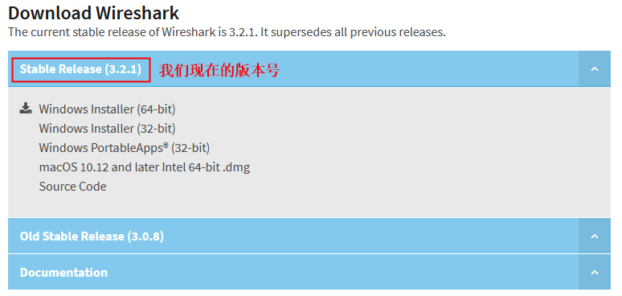

## Wireshark 安装

双击 ==Wireshark-win64-3.2.1.exe== 进行安装，如下安装过程：

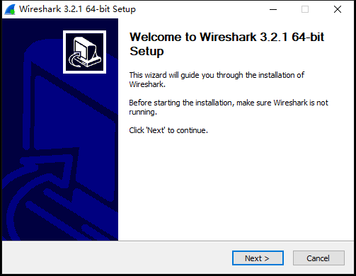

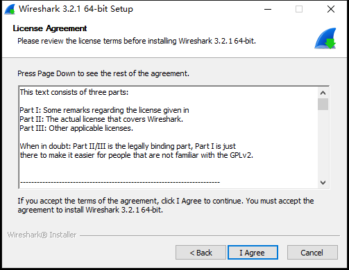

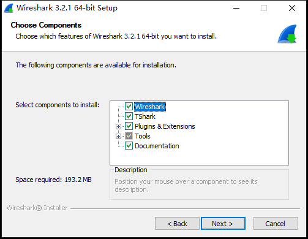

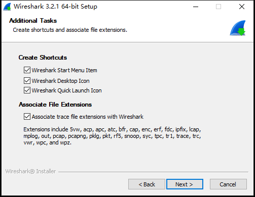

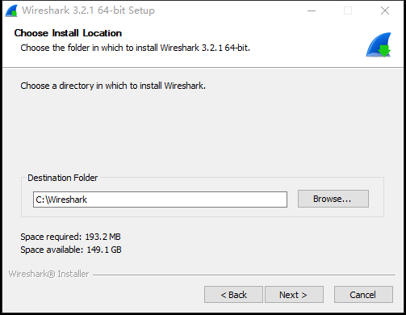

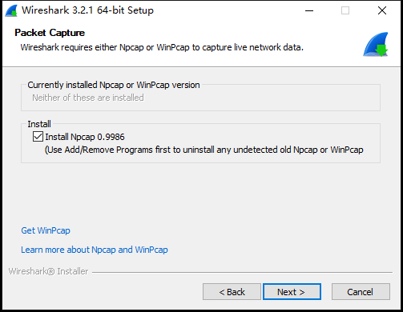

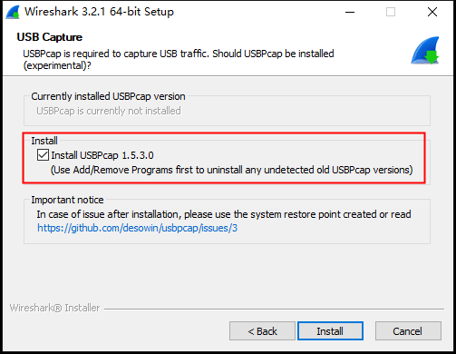

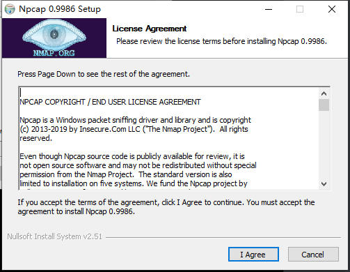

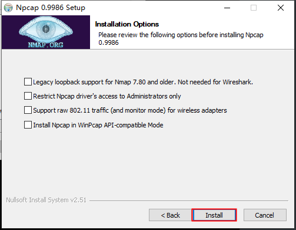

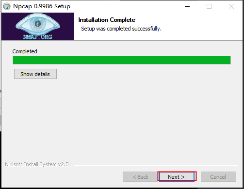

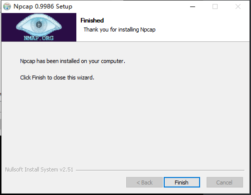

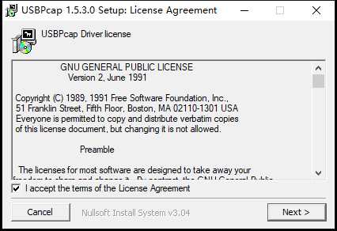

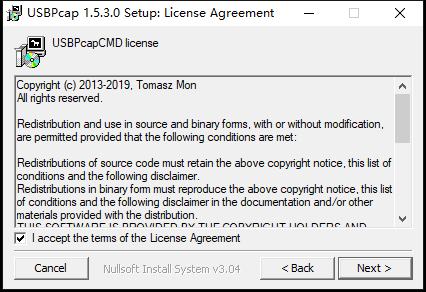

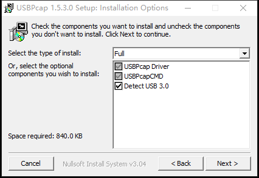

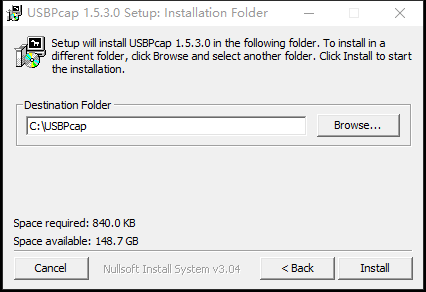

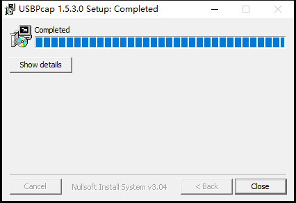

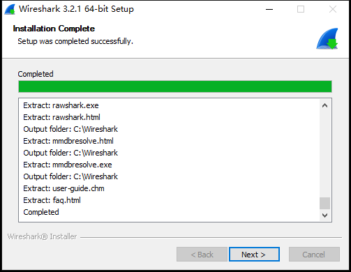

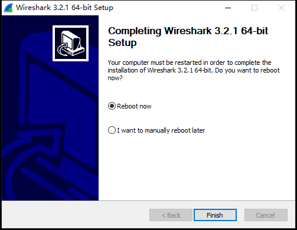

安装完成之后，重启电脑。