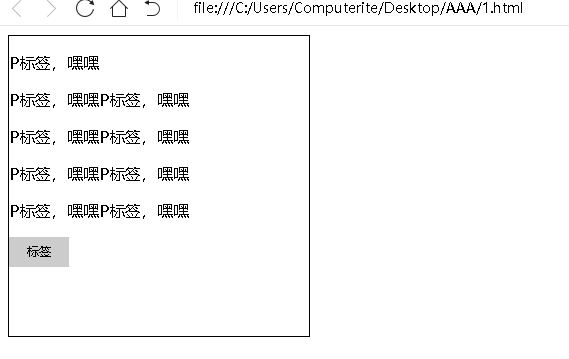

## 1、position:absolute;【绝对定位】

首先是absolute【绝对定位】，所谓绝对定位，就是当一个元素，申明了position: absolute以后，那么可以通过上[top]、右[right]、下[bottom]、左[left]对元素进行任何位置的摆放(定位)，并且脱离了文档流。

那么，什么叫脱离文档流呢?简单的说，这个元素在没position: absolute之前，这个元素所在的位置，会占据html页面显示的位置，而position: absolute以后(脱离文档流)，它本身的位置，就没啦，这个就是脱离文档流，我们看下如下的图与代码：

如上代码，是一堆没有任何样式的div与p，显示效果如下：

我们注意下【我是一个p元素，我是一个p元素，我是一个p元素，我是一个p元素，】这里的内容与位置，这个p标签，本身占据了html显示的位置，当我们给它position: absolute以后，我们在看如下图：

我们对p标签进行了position: absolute申明，那么我们看如下效果图：

首先，P标签，脱离了文档流，用大白话说，p标签这个元素以前的位置，被删除了，在正常html现实中，就没有了这个p标签的位置，而，我们可以用top与left进行位置的定位，明白了嘛?其实很简单啦。

## 2、position: relative;【相对定位】

相对定位，是相对于这个元素本身的位置进行定位，并且不会脱离文档流，如下：

然后，我们在看下图：

我们在看效果：

没有任何变化，对不对?OK，我们继续往下看：

当我们给它top为50的时候，p标签的位置，发生了变化，但是，它本身的占位并没有删除，这个，和position:absolute;是不一样的地方，position: relative;并不会脱离文档流，position: relative;还有另一个用法，我们文章的最后在来讲。

下边，我们再来看看position: fixed;

## 3、position: fixed;【绝对定位/相对于浏览器窗口进行定位】

position: fixed也是绝对定位，只不过是相对于浏览器窗口进行定位，这个是什么意思呢?我们看如下图：

以上是一个例子代码，我们再看下如下的正常效果：

以上，是未进行定位的效果，那么，我们来给它一个position: fixed试一试，如下图代码：

我们看下效果：

首先，它也是脱离文档流的，然后我们看下右侧的滑动条，会发现，无论滑动条怎么滑动，它的位置都不会变动，这就是相对于浏览器窗口进行定位，一般用于返回顶部的按钮啊，或者侧边栏的联系啊，微信啊等等。

## 4、relative与absolute的组合使用

前者与后者，会组合起来使用，并且，我们会常常用到，那么在什么时候会用到呢?我们看如下图：

下图是效果：

这个时候，通常我们会实现一个小效果，就是灰色的标签位于黑色框子的右上角，这个时候，我们怎么实现呢?如果单一的用position:absolute;是不可以的，如下：

我们看下效果，如下图：

这个时候，会脱离.box这个盒子，跑到了浏览器显示区域的右上角，这样的效果，不是我们需要的，那么用position: relative可以吗?相对定位，是可以的，但是很不方便，如下图：

但是，这样，很不方便，不仅仅要计算准确的top与right，而且，不会脱离文档流，并且，当里边的P标签，多一个，就会出问题，那么有没有完美的解决方法呢?其实，它们两个货组合起来就可以，如下：

我们在父级元素，增加了相对定位，在.box-info这个块，增加了决定定位，效果如下：

这样，内容多少，就不会影响，这样，才是完美的解决方案，这里我简单的说下逻辑：

我们给.box增加了相对定位以后，那么这个盒子里边的元素，在使用决定定位的时候，就会相对与父级元素来定位。大家多念几遍这句话，就明白了，其实很容易理解。