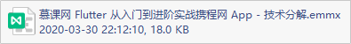
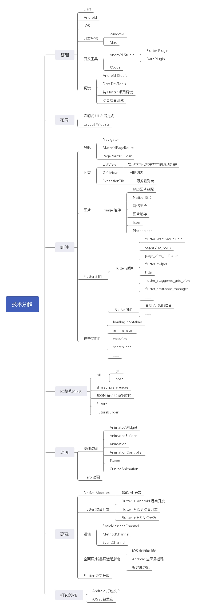

# 需求分析

## 首页模块

Banner

可配置的入口

网格卡片

资源运营位

滚动渐变的特效

## 搜索模块

实时搜索

自定义搜索框

兼容语言搜索

富文本展示搜索结果

## AI 语音模块

混合开发

Native SDK

Flutter Plugin

Channel 通信

## 旅拍模块

瀑布流布局

tab 滑动切换

支持下拉刷新

支持上拉加载更多

## 我的模块

H5 混合开发

Flutter-H5 通信

自定义 WebView

# 技术分解

查看 `慕课网 Flutter 从入门到进阶实战携程网 App - 技术分解.emmx` 文件，

附带图片格式：

