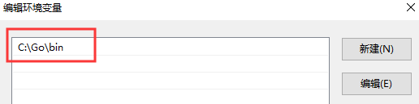
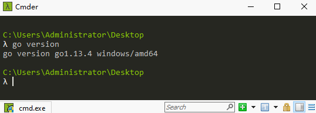
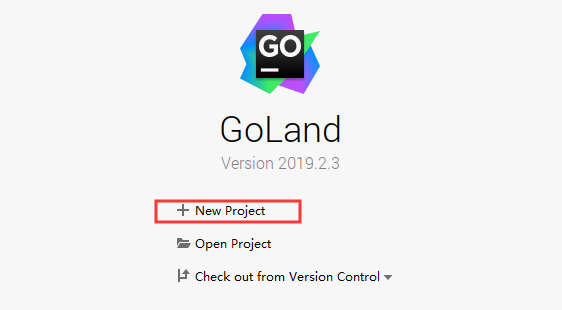
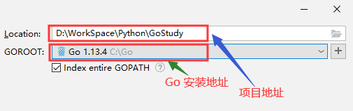
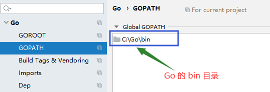

目录结构如下
[TOC]

# 下载安装

## 下载

下载地址： https://studygolang.com/dl 或者  https://golang.google.cn/dl/ 。这里开发环境为 Windows 环境，所以下载 ==go1.13.4.windows-amd64.msi== 进行安装。

## 安装

安装时，不要安装在中文路径下。这里安装的地址为：C:\Go\，安装完成之后，系统会自动把 bin 目录加入到环境变量中，如下图所示：



如果没有，则需要手工添加到 path 环境变量中。打开 CMD 在命令行输入：

```shell
go version
```

结果如下图所示：



说明 Go 环境安装成功。

# 创建项目

这里使用 JetBrains 全家桶的 GoLand IDE 作为 Go 开发环境。

打开 GoLand IDE ，单击 New Project，如下图所示：

## 创建项目



## 配置 GOROOT 变量



## 配置 GOPATH 变量



我们创建了一个 GoStudy 的 Go 项目了。

# 开始学习

## 第一个例子


